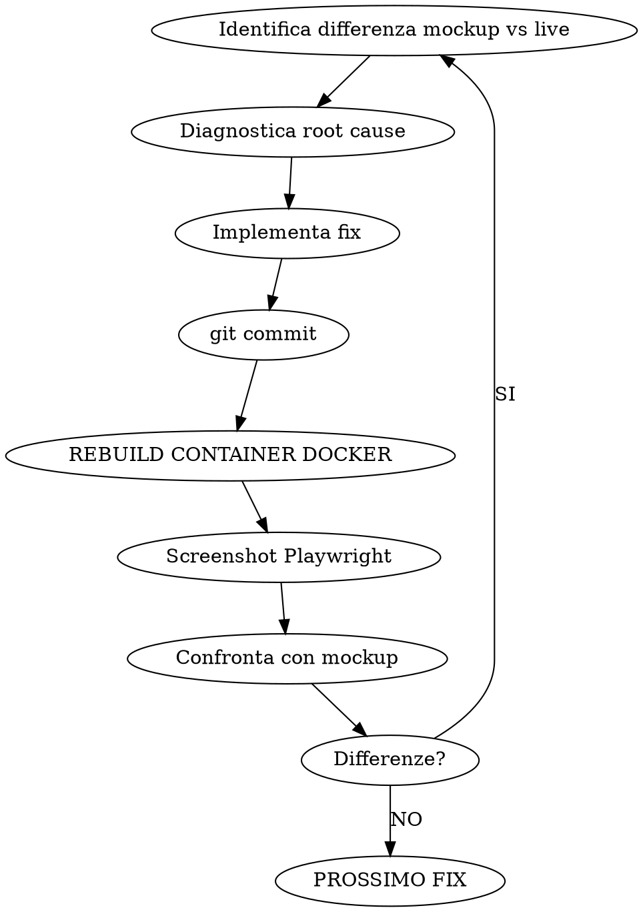
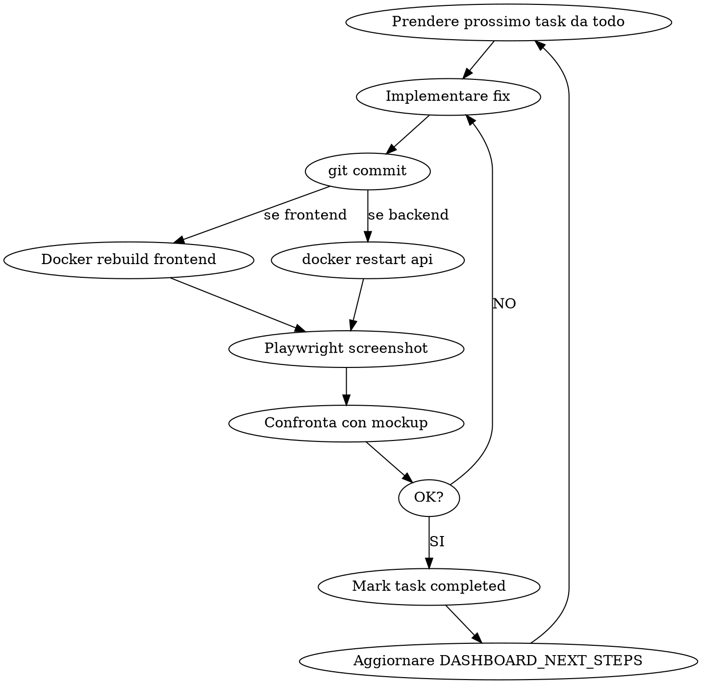

# Dashboard Jobs — Skill Operativa Autoaggiornante

Orchestration completa per lavori su dashboard Heuresys: setup contesto, mockup visivo, implementazione,
verifica Playwright, Docker rebuild, confronto pixel-perfect.

## SETUP OBBLIGATORIO — Eseguire PRIMA di qualsiasi azione

### 1. Leggere memoria (in ordine)

```
Read memory/DASHBOARD_NEXT_STEPS.md        # Stato corrente, problemi aperti
Read memory/feedback_dashboard_workflow.md  # Regole Docker, Playwright, mockup
Read memory/feedback_self_improvement_dashboard.md  # Errori da non ripetere
Read memory/reference_dashboard_context_setup.md    # Setup completo con script
Read memory/feedback_reuse_first.md         # P11 — Reuse-First Admin Components
Read memory/reference_admin_component_registry.md   # Come interrogare il registry
Read memory/feedback_data_driven_p9_reinforce.md    # Zero hardcoded
```

### 1-bis. REUSE-CHECK OBBLIGATORIO (P11, introdotto 2026-04-10)

**PRIMA di scrivere qualsiasi UI nuova o modificare una pagina esistente**,
interrogare il registry `admin_component_registry`:

```bash
# Lista componenti per area funzionale
TOKEN=$(curl -s -X POST http://localhost:8012/api/v1/auth/login \
  -H 'Content-Type: application/json' \
  -d '{"username":"<user>","password":"<pwd>"}' | jq -r .data.accessToken)
curl -s -H "Authorization: Bearer $TOKEN" \
  "http://localhost:8012/api/v1/admin-components/by-area/PERFORMANCE"

# Oppure SQL diretto
docker exec heuresys_evo_platform_db bash -c \
  "psql -U \$POSTGRES_USER -d \$POSTGRES_DB -c \"SELECT code, name, frontend_path, export_name, prop_shape FROM admin_component_registry WHERE functional_area_code='PERFORMANCE';\""
```

**Regola**: se un componente compatibile esiste → riusarlo via import dal
`frontend_path` (pattern `PortalPageShell` per i wrapper). Se non esiste →
creare il componente in una directory condivisa E registrarlo nel registry
(INSERT in migration o INSERT runtime) durante la stessa sessione.

**Gate**: non si scrive UI nuova senza aver loggato l'esito del reuse-check.

### 2. Leggere spec e mockup

```
Read docs/superpowers/specs/2026-04-08-employee-dashboard-design.md   # Spec design
# Il mockup HTML e' la FONTE DI VERITA' VISIVA:
Read .superpowers/brainstorm/702426-1775610642/content/employee-portal-v5.html
```

### 3. Verificare servizi

```bash
docker ps --format "table {{.Names}}\t{{.Status}}" | grep heuresys  # 4 container
curl -s http://localhost:8012/health                                  # API
curl -s -o /dev/null -w "%{http_code}" http://localhost:3012          # Frontend
PGPASSWORD=heuresys psql -h localhost -p 5433 -U heuresys -d heuresys_platform -c "DELETE FROM login_attempts"
```

### 4. Avviare mockup server (IP pubblico per browser remoto)

```bash
BRAINSTORM_PORT=8765 ~/.claude/plugins/cache/claude-plugins-official/superpowers/5.0.7/skills/brainstorming/scripts/start-server.sh \
  --project-dir /home/ubuntu/heuresys-advanced --host 0.0.0.0 --url-host 80.225.82.207
# Se nuova session dir, copiare il mockup:
cp .superpowers/brainstorm/702426-1775610642/content/employee-portal-v5.html \
   .superpowers/brainstorm/<NEW_SESSION>/content/
```

URL utente: `http://80.225.82.207:8765`
ATTENZIONE: il server si spegne dopo 30min di inattivita'. Riavviarlo se necessario.

### 5. Screenshot baseline (Playwright)

PRIMA di qualsiasi modifica, prendere screenshot del live e del mockup per confronto.

```javascript
// File: /tmp/dashboard-baseline.mjs
import { chromium } from '/home/ubuntu/heuresys-advanced/node_modules/playwright/index.mjs';
const browser = await chromium.launch({
  headless: true,
  executablePath: '/home/ubuntu/.cache/ms-playwright/chromium-1217/chrome-linux/chrome'
});
// LIVE (con login)
const live = await browser.newPage({ viewport: { width: 1440, height: 900 }, deviceScaleFactor: 2, colorScheme: 'dark' });
await live.goto('http://localhost:3012/login');
await live.waitForLoadState('networkidle');
await live.fill('input[type="text"]', 'rtl-bank.pietro.barbieri');
await live.fill('input[type="password"]', 'password');
await live.click('button[type="submit"]');
await live.waitForURL('**/portal**', { timeout: 15000 });
await live.waitForLoadState('networkidle');
await live.waitForTimeout(5000);
await live.screenshot({ path: '/tmp/baseline-live.png', fullPage: true });
// MOCKUP
const mock = await browser.newPage({ viewport: { width: 1440, height: 900 }, deviceScaleFactor: 2, colorScheme: 'dark' });
await mock.goto('http://localhost:8765');
await mock.waitForTimeout(2000);
await mock.screenshot({ path: '/tmp/baseline-mockup.png', fullPage: true });
await browser.close();
```

Eseguire: `node /tmp/dashboard-baseline.mjs`
Poi: `Read /tmp/baseline-live.png` e `Read /tmp/baseline-mockup.png` per confronto visivo.

---

## REGOLA FERREA: Ciclo Fix-Verify



### Docker Rebuild (OGNI fix frontend)

```bash
docker compose -f infra/docker-compose.yml -f infra/docker-compose.dev.yml build frontend 2>&1 | tail -3
docker compose -f infra/docker-compose.yml -f infra/docker-compose.dev.yml up -d frontend 2>&1 | tail -3
sleep 8  # Attendere container healthy
```

### MAI dire "fixato" senza:
1. Commit eseguito
2. Container Docker rebuiltato
3. Screenshot Playwright DOPO rebuild
4. Confronto visivo screenshot vs mockup
5. Tutte le differenze risolte

---

## Credenziali Test

| Utente | Username | Password | Ruolo | Redirect |
|--------|----------|----------|-------|----------|
| EMPLOYEE puro RTL Bank | rtl-bank.pietro.barbieri | password | EMPLOYEE | /portal |
| SUPERUSER | sysadmin | sysadmin123 | SUPERUSER | /platform |

Password RTL Bank employees: `password` (NON Admin2026).
SEMPRE cancellare login_attempts prima di ogni test.

---

## Architettura Widget Engine

```
Login → redirect per ruolo → /portal (EMPLOYEE)
  → PortalLayout (sidebar + header + footer)
    → DynamicSidebar (da useSidebarNav → GET /api/rbp/dashboard/:slug/nav-items)
    → PortalHeader (tenant title, search, theme, notifications, avatar)
    → PortalFooter ("Powered by Heuresys | (c) 2026")
    → HeroSection (avatar ring animato, greeting, nome, ruolo)
    → WorkspaceRenderer (CSS Grid 12-col)
      → useWorkspace() → GET /api/v1/workspace/me
      → Per ogni widget: WidgetFactory(code) → lazy load componente tipo
        → useWidgetData(code) → GET /api/v1/workspace/widget/:code/data
```

### File chiave

| Componente | Path |
|-----------|------|
| Portal layout | `services/frontend/src/components/portal/portal-layout.tsx` |
| Sidebar | `services/frontend/src/components/portal/dynamic-sidebar.tsx` |
| Header | `services/frontend/src/components/portal/portal-header.tsx` |
| Footer | `services/frontend/src/components/portal/portal-footer.tsx` |
| Tenant logo | `services/frontend/src/components/portal/tenant-logo.tsx` |
| Widget factory | `services/frontend/src/components/widgets/widget-factory.tsx` |
| Widget wrapper | `services/frontend/src/components/widgets/widget-wrapper.tsx` |
| Workspace renderer | `services/frontend/src/components/widgets/workspace-renderer.tsx` |
| Hero section | `services/frontend/src/components/widgets/hero-section.tsx` |
| CSS effetti | `services/frontend/src/components/widgets/widget-effects.css` |
| Widget types | `services/frontend/src/components/widgets/types/*.tsx` |
| Workspace API | `services/api-gateway/src/routes/workspace.ts` |
| Workspace hook | `services/frontend/src/lib/hooks/use-workspace.ts` |
| Workspace endpoints | `services/frontend/src/lib/api/endpoints/workspace.ts` |
| Login redirect | `services/frontend/src/app/login/page.tsx` (linea ~124) |

### Principi architetturali

- **Ogni utente e' SEMPRE anche EMPLOYEE** — employee_portal accessibile da tutti i ruoli (migration 163)
- **Zero hardcoded frontend** — tutto data-driven dal DB via API
- **6 layer indipendenti**: Layout (DB), Widget catalog (DB), Widget renderer (React), Data source (DB JSONB), Theme (CSS vars), Sidebar (DB nav_items)
- **Frontend in Docker** → OGNI modifica richiede rebuild container

---

## Gestione Ciclo di Vita Completo

Questa skill gestisce l'INTERO processo — dal setup al completamento, incluso tracking e documentazione.

### Fase 1: Setup Contesto (vedi sopra)

### Fase 2: Analisi Stato e Pianificazione

1. Leggere `memory/DASHBOARD_NEXT_STEPS.md` per problemi aperti
2. Leggere `docs/superpowers/plans/2026-04-08-employee-dashboard-plan.md` per il piano
3. Confrontare mockup vs live con Playwright (screenshot baseline)
4. Creare TodoWrite con TUTTI i fix/task pendenti dalla lista in DASHBOARD_NEXT_STEPS
5. Presentare all'utente: "Stato attuale: X problemi aperti. Propongo di lavorare su: [lista prioritizzata]"

### Fase 3: Esecuzione (per OGNI task)



Ad OGNI task completato:
- Marcare completed nel TodoWrite
- Aggiornare `memory/DASHBOARD_NEXT_STEPS.md` (rimuovere problema risolto)
- Se impatto su spec/piano: aggiornare i rispettivi file

### Fase 4: Report Stato (on-demand)

Quando l'utente chiede "a che punto siamo" o "stato":
1. Leggere TodoWrite per task in corso e completati
2. Leggere `memory/DASHBOARD_NEXT_STEPS.md` per pending
3. Prendere screenshot Playwright del live attuale
4. Presentare: completati, in corso, pendenti, screenshot attuale vs mockup

### Fase 5: Chiusura Sessione

A FINE sessione (quando l'utente dice "chiudi", "basta", "stop"):
1. Aggiornare `memory/DASHBOARD_NEXT_STEPS.md` con stato REALE
2. Aggiornare sezione "Learnings" di QUESTA skill con nuove scoperte
3. Aggiornare `CLAUDE.md` root se nuovi componenti/API creati
4. Aggiornare `docs/DASHBOARDS_CONSTITUTION_MAP.md` se stati dashboard cambiati
5. Aggiornare `docs/BLUEPRINT_ROLES_DASHBOARDS_PAGES.md` se task M0-M5 completati
6. Committare e pushare TUTTO (inclusa questa skill aggiornata)
7. Prendere screenshot finale Playwright come evidenza

---

## Brainstorming Nuove Dashboard

Quando si progetta una NUOVA dashboard (non fix dell'esistente):

1. Invocare `superpowers:brainstorming` skill
2. Avviare mockup server su porta 8765 con IP pubblico
3. Creare mockup HTML iterativi (v1, v2, v3...) con confronto via browser remoto
4. L'utente vede e approva dal suo Mac via `http://80.225.82.207:8765`
5. Spec → Piano → Implementazione → Verifica Playwright
6. Ogni iterazione mockup: screenshot + confronto con utente via visual companion

---

## AUTOAGGIORNAMENTO

**Questa skill e' autoaggiornante.** A fine di OGNI sessione dashboard:

1. Aggiornare la sezione "Learnings" sotto con nuove scoperte
2. Aggiornare credenziali se cambiate
3. Aggiornare file chiave se nuovi componenti creati
4. Aggiornare `memory/DASHBOARD_NEXT_STEPS.md` con stato corrente
5. Aggiornare tutta la documentazione di progetto toccata
6. Committare e pushare le modifiche a questa skill + docs + memoria

### Learnings (aggiornare ad ogni sessione)

**2026-04-08 — Sessione iniziale:**
- Il campo nel DB workspace_templates si chiama `widget_code`, il frontend aspetta `code` → mappare nel backend
- Quick links API deve ritornare `{links: [{label, path, icon}]}` non `{items: [{label, url, icon}]}`
- Sidebar labels vengono da `rbp_dashboard_nav_items.label` nel DB — sono in inglese, serve tradurre
- I section titles vengono dal campo `section` del DB — mappati a italiano nel componente DynamicSidebar
- Il plugin Playwright MCP non funziona su ARM64 — usare Chromium diretto con script Node.js
- `@property --angle` per conic-gradient rotante richiede CSS Houdini
- Il mockup server superpowers si spegne dopo 30min — riavviarlo
- Il frontend Docker container usa standalone build — file in `/app/server.js`, non in `src/`
- `e.department` in employees e' un testo libero (codice org_unit), non il nome leggibile
