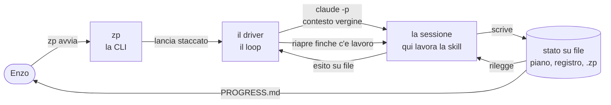
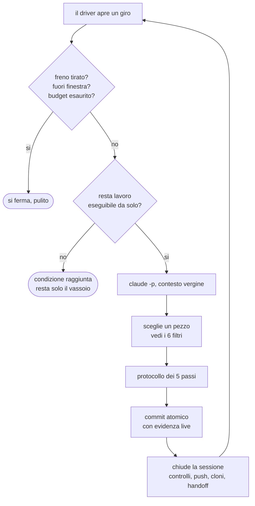
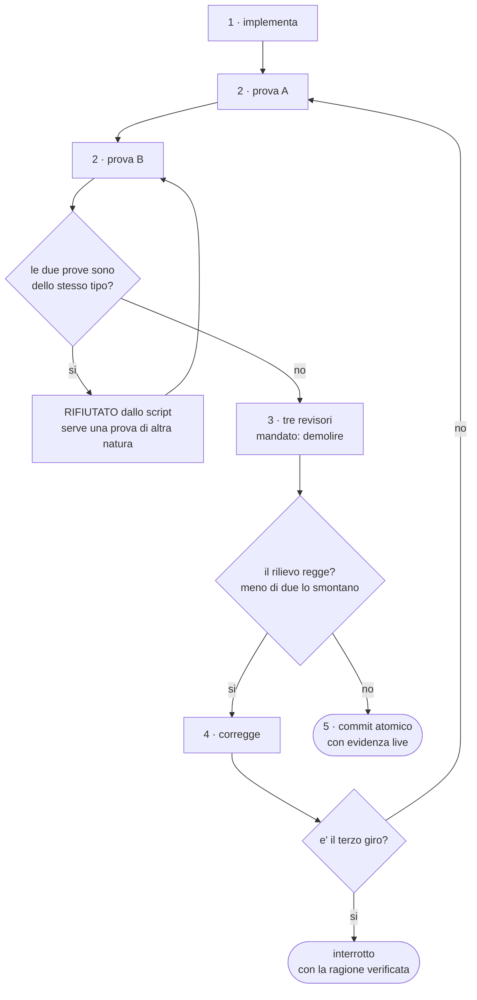
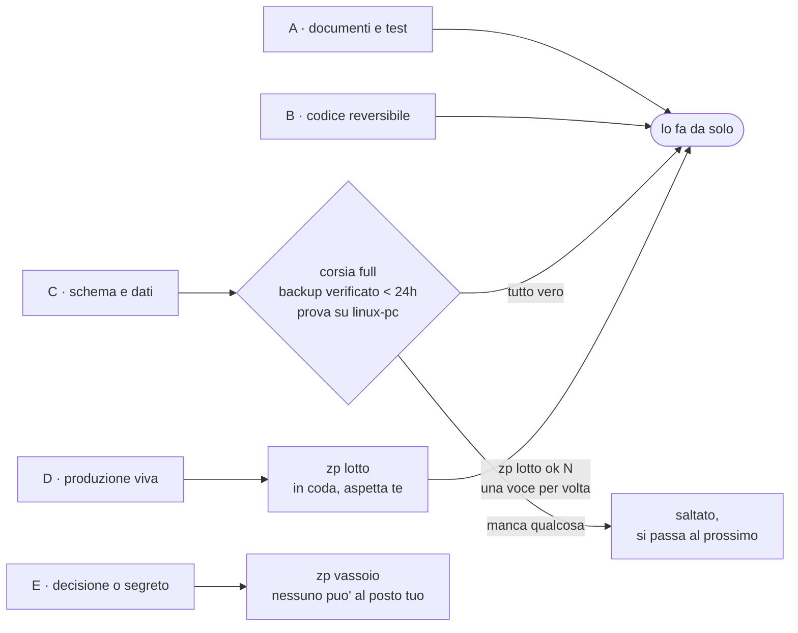
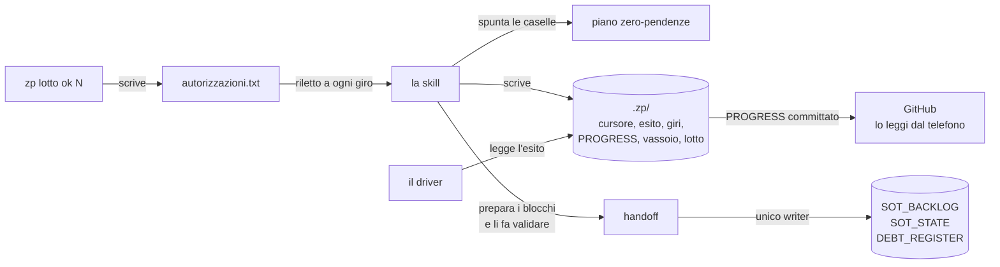
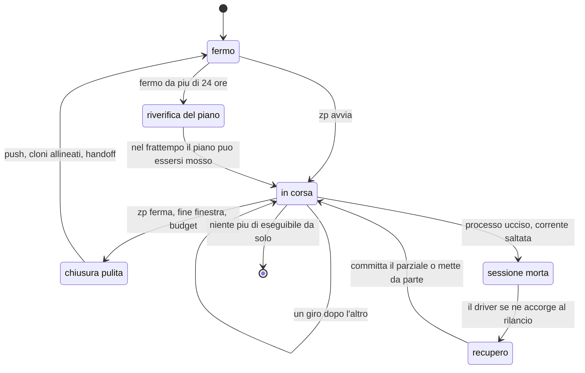

# zero-pending-loop — guida di riferimento

Un impianto che porta heuresys-advanced verso zero pendenze lavorando da solo, di notte, senza sorveglianza: chiude un pezzo di lavoro alla volta, lo verifica due volte in modi diversi, lo fa demolire da tre revisori indipendenti, e si ferma da sé davanti a tutto ciò che tocca la produzione viva o richiede una decisione di Enzo.

**Creato**: 2026-07-25, sessione Cowork con Enzo Spenuso
**Design**: `docs/superpowers/specs/2026-07-25-zero-pending-loop-design.md`
**Piano di lavoro**: `docs/superpowers/specs/2026-07-25-zero-pending-plan.md`

## Come leggere questo documento

| Se… | Vai a |
|---|---|
| devi solo **usarlo** | §2 Guida d'uso |
| vuoi capire **com'è fatto** | §3 e §4 |
| devi **modificarlo o ripararlo** | §5, §6, §11 |
| ti chiedi **perché è fatto così** | §8 |
| non capisci una parola | §10 Glossario |

---

## 1. Che cos'è, in tre frasi

Il progetto ha un piano di pendenze: alcune centinaia di pezzi di lavoro censiti — quanti esattamente lo dice `python docs/kb/tools/zp_state.py piano`, e il numero cresce a ogni sessione che ne scopre di nuovi — raggruppati in ondate, ognuno con una condizione di chiusura verificabile con un comando.

Questo impianto prende quel piano e lo esegue: sceglie il prossimo pezzo, lo implementa, lo verifica, lo fa criticare, lo corregge, lo committa, aggiorna lo stato e ricomincia — finché non resta niente che possa fare da solo.

Quello che **non** è: non decide la direzione del prodotto, non scopre pendenze nuove fra un censimento e l'altro, e non tocca mai la produzione viva senza il via di Enzo.

---

## 2. Guida d'uso

Tutto passa da un comando: **`zp`**. Va lanciato da una finestra PowerShell — una nuova, se hai appena installato l'impianto, perché il comando si carica all'avvio del profilo.

### I comandi

| Comando | Cosa fa |
|---|---|
| `zp prova` | mostra quali pezzi prenderebbe e in che ordine, senza fare niente |
| `zp avvia` | parte e lavora da solo in background. Puoi chiudere la finestra |
| `zp ferma` | lo fa fermare in modo pulito: finisce il pezzo in mano e chiude bene |
| `zp riprendi` | riparte da dove era rimasto |
| `zp stato` | dice se sta girando, l'età del piano, e mostra l'ultimo rapporto |
| `zp mattina` | il riepilogo del risveglio: stato più tutto ciò che aspetta te |
| `zp vassoio` | cosa è bloccato su di te, e cosa serve esattamente |
| `zp lotto` | cosa aspetta il tuo via perché tocca la produzione |
| `zp lotto ok 2` | dai il via alla voce numero 2 di quella lista |
| `zp giri` | come sono andati gli ultimi dieci giri |
| `zp censimento` | dice quanto è vecchio il piano e cosa comporterebbe rifarlo |
| `zp censimento ok` | rifà il censimento da zero e crea un piano nuovo |
| `zp notte` | dice se ha il turno di notte, e a che ora |
| `zp notte on` | gli dà il turno di notte: parte da solo ogni sera |
| `zp notte off` | glielo toglie |
| `zp help` | ristampa l'elenco con gli esempi |

### Le opzioni

| Opzione | Effetto |
|---|---|
| `-Iterazioni 5` | quanti pezzi per corsa |
| `-Corsia safe` | tocca solo documenti, test e codice annullabile con un revert |
| `-Corsia full` | aggiunge schema e dati, con backup verificato di meno di 24 ore |
| `-Finestra 22:00-07:00` | in quale fascia oraria lavorare |
| `-Budget 40` | tetto di spesa in dollari, solo per il censimento |

### Il ritmo consigliato

La prima volta, un pezzo solo, per giudicare la qualità del lavoro e delle prove:

```
zp avvia -Iterazioni 1
```

Poi guarda `zp giri` (quanto è costato, quanto è durato) e `zp stato` (cosa ha fatto e con quale prova). Se ti convince, alzi i numeri.

A regime, due comandi in tutto:

```
zp notte on      una volta sola
zp mattina       ogni mattina
```

Lui lavora dalle 22 alle 7, tu la mattina guardi cosa ha fatto e sblocchi ciò che aspetta te. Se `zp mattina` dice «niente che aspetti te», chiudi il terminale e vai a fare altro.

Quando serve fermarlo: `zp ferma`. Non tronca niente — finisce il pezzo in mano, fa la chiusura completa (controlli, commit, push, allineamento macchine) e si ferma. Non perdi nulla. Per ripartire: `zp riprendi`.

Dopo mesi di sviluppo tuo: `zp censimento` ti dice quanto è vecchio il piano, `zp censimento ok` ne costruisce uno nuovo sullo stato di oggi.

---

## 3. I tre pezzi, e chi fa cosa

**`zp` — la CLI.** Uno script PowerShell. È l'interfaccia: controlla le condizioni, avvia, ferma, riferisce. Non ragiona sul merito del lavoro.

**Il driver — il loop.** Uno script bash. Apre una sessione, legge com'è andata, ne apre un'altra. Non sa nemmeno cosa sia un pezzo di lavoro.

**La skill — il cervello.** Istruzioni per Claude. Sceglie il pezzo, lo esegue, lo verifica, decide se continuare o chiudere.



Il punto che non è ovvio è perché il loop stia fuori dalla sessione. Una sessione non può azzerare il proprio contesto e proseguire: `/clear` è un comando che dai tu al programma, non un'azione che il modello può compiere su sé stesso. Quindi chi ripete deve stare fuori: ogni volta che il driver lancia `claude`, quella sessione nasce con contesto vergine — ed è quello il `/clear`, ottenuto per costruzione invece che per comando.

Ne segue la regola che governa tutto il resto: **lo stato vive su file, mai in conversazione.** La sessione successiva non ricorda niente, rilegge. Ed è proprio questo che rende l'impianto robusto alle interruzioni brutali — corrente che salta, terminale chiuso, errore del modello: lo stato è su disco, e la ripresa è una lettura.

---

## 4. Come lavora davvero

### Il giro, visto dall'alto



### I modi della skill

| Modo | Quando | Cosa fa |
|---|---|---|
| `bootstrap` | prima volta, o piano incoerente | apre la sessione, **verifica** il piano invece di rifarlo, aggiorna solo le fonti invecchiate, dichiara le regole con cui opererà |
| `resume` | ogni giro | sceglie un pezzo, lo porta a termine, aggiorna piano e registro, decide se continuare o chiudere |
| `close` | pezzo finito, freno tirato, fine ondata | chiusura completa: controlli, commit, push, allineamento macchine, handoff. Poi segnala al driver di ripartire |
| `recover` | sessione morta senza chiudere | ricostruisce dal cursore e dal working tree: committa il parziale se i controlli sono verdi, altrimenti mette da parte e segna il punto di ripresa |
| `censimento` | solo se lo chiedi tu | rilegge tutto da capo e scrive un piano nuovo |
| `report` | quando vuoi | stato leggibile, non tocca niente |

### Come sceglie il prossimo pezzo

Non a intuito. Applica questi filtri in ordine e prende il primo che sopravvive.

1. **Interrotto a metà**, con un punto di ripresa. Priorità assoluta: è la cosa più fragile che esiste nel repo, perché più resta aperta più svanisce il contesto che la giustificava.
2. **Blocca altro lavoro.** Chiuderne uno ne sblocca N.
3. **Appartiene all'ondata corrente.** Non si salta avanti: le ondate sono ordinate perché la rete di sicurezza — test e CI — protegge tutto ciò che viene dopo.
4. **Ha tutte le dipendenze risolte.** Forzare un pezzo non pronto produce lavoro da rifare.
5. **La sua classe è ammessa dalla corsia attiva.**
6. **Sta nel budget del giro.** Meglio un pezzo chiuso che due a metà.

A parità di tutto, l'effort minore prima: libera caselle e rende il rapporto più informativo per chi legge da fuori.

### Il protocollo di esecuzione: i cinque passi

1. **Implementa** seguendo i pattern del repo. Se per chiudere servisse violare un invariante architetturale, si ferma: niente aggiramenti, il pezzo va nel vassoio con la contraddizione scritta.
2. **Due prove di natura diversa.** Non due test: due *tipi* di prova. L'esempio che chiarisce tutto è un test d'integrazione verde accanto a una query sul database che mostra che la riga non è stata scritta — cosa che due test d'integrazione non avrebbero visto mai. Uno script rifiuta meccanicamente una coppia omogenea.
3. **Tre revisori adversarial.** Contesto vuoto, vedono solo il diff, lenti distinte (correttezza, isolamento e sicurezza, riproducibilità), mandato di demolire. Un rilievo cade solo se almeno due lo smontano.
4. **Corregge e ri-verifica.** Massimo due giri; al terzo il pezzo va interrotto con la ragione verificata.
5. **Commit atomico con evidenza live.** Nessun pezzo si chiude su un test verde: serve una prova su dati reali con comando, output, path e timestamp.



Perché i revisori non sono teatro: hanno contesto vuoto, quindi non condividono il punto cieco di chi ha scritto il codice; il mandato è negativo, e un revisore premiato per il «va bene» non è un revisore; la regola di maggioranza evita che uno paranoico blocchi tutto da solo.

### Le cinque classi di rischio

Rispondono a una domanda sola: *se va storto mentre nessuno guarda, quanto male fa e quanto ci vuole a tornare indietro?* È una domanda **indipendente dall'ondata**: un pezzo può essere rapido e pericoloso insieme.

| Classe | Cosa tocca | In automatico | Come si torna indietro |
|---|---|---|---|
| **A** | documenti, spec, test aggiunti | sì | revert, zero conseguenze |
| **B** | codice, senza schema né contratti pubblici | sì | `git revert` del commit atomico |
| **C** | schema e dati | solo in corsia `full`, dopo prova su linux-pc e con backup verificato di meno di 24 ore | restore dal dump |
| **D** | produzione viva: deploy, riavvii, secrets, retention | **mai** | può richiedere intervento manuale |
| **E** | serve una decisione o un input di Enzo | **mai** | non si parte nemmeno |

Corsia `safe` = A + B. Corsia `full` = A + B + C. La classe D non entra mai in automatico, e la garanzia sta nello script che filtra i candidati, non nella disciplina del modello: un controllo che dipende dal buon comportamento di chi lo deve subire non è un controllo.



### I controlli, derivati a runtime

Non c'è una lista fissa di test da lanciare: si guarda cosa è stato toccato, con `git diff --name-only`, e si eseguono i controlli di quelle aree soltanto.

| Area toccata | Controlli |
|---|---|
| `apps/api` | typecheck, lint, test sui moduli toccati **e** dipendenti, integrazione sul database reale |
| `apps/web` | typecheck, lint, parità i18n, Playwright sulle spec pertinenti |
| `packages/shared` | typecheck a monte, rebuild dei consumer |
| `db/migrations` | applicate due volte con diff `pg_dump` vuoto, validazione delle 7 viste |
| `scripts`, `deploy` | lint shell e dry-run del percorso modificato |
| `docs/kb` | il linter di handoff, 10 controlli bloccanti |

Un'area toccata senza controlli mappati è un errore bloccante, non un salto silenzioso. E non si lancia mai tutta la suite: costa, e nasconde quale controllo stava proteggendo cosa.

### Lo stato, tutto su file

Chi scrive cosa. La regola che tiene in piedi il disegno è che **la skill non scrive mai nel registro ufficiale**: prepara i blocchi, li fa validare dal linter, e la scrittura la fa `handoff`. Un solo writer per file, nessuna seconda verità.



| File | Cosa contiene |
|---|---|
| il piano zero-pendenze | caselle spuntate più la nota di chiusura con evidenza |
| `docs/kb/SOT_BACKLOG.md` | il registro ufficiale. Ci scrive **solo** `handoff` |
| `.handoff/session-journal.ndjson` | fatti annotati mentre emergono |
| `.zp/cursor.json` | pezzo corrente, passo raggiunto, giro |
| `.zp/last-outcome.json` | il segnale per il driver |
| `.zp/runs.ndjson` | un record per giro: costo, durata, esito |
| `.zp/PROGRESS.md` | la vista umana. Committato a ogni chiusura, così lo leggi su GitHub dal telefono |
| `.zp/vassoio.md` | cosa nessuno può sbloccare al posto tuo |
| `.zp/lotto-presidiato.md` | cosa aspetta il tuo via |
| `.zp/autorizzazioni.txt` | scritto da `zp lotto ok`, letto dalla skill |

### Interrompere e riprendere

Nessun modo di fermarlo perde lavoro, perché lo stato è su disco e ogni chiusura pulita fa push. Cambia solo quanto costa la ripartenza.



---

## 5. Mappa dei file

Nel repo, versionati, viaggiano con git e con `align-clones`:

```
.claude/skills/zero-pending-loop/
    README.md              questo documento
    SKILL.md               il router: modi, contratto col driver, le 5 regole
    references/
        bootstrap.md       prima invocazione e il modo censimento
        selection.md       stato su file, cursore, ordine di scelta del pezzo
        protocol.md        i 5 passi, le coppie di prove, il blocco di evidenza
        adversarial.md     i 3 revisori: lenti, prompt, regola di maggioranza
        blast-radius.md    le classi A-E, le corsie, il formato delle liste
        gates.md           matrice dei controlli e trappole verificate del repo
        operations.md      modelli, budget, /goal, casi di degradazione
        close.md           chiusura sessione, perimetro del push, modo report
        driver.md          interruzione, ripresa, recupero, guard-rail
        zp.config.yaml     LA CONFIGURAZIONE VIVA: tutte le manopole
        LEARNINGS.md       trappole gia' pagate e formato del run-record
    evals/
        trigger-eval.json  20 frasi: 10 devono attivarla, 10 no
        evals.json         6 casi di prova sul comportamento

scripts/zero-pending-driver.sh    il loop
docs/kb/tools/zp_state.py         cursore e selezione
docs/kb/tools/zp_gate.py          controlli e prove
docs/kb/tools/zp_evidence.py      blocco di evidenza
docs/kb/tools/zp_zero_check.py    la condizione di fine
docs/kb/tools/zp_classify.py      la classe di rischio di ogni pezzo
docs/kb/tools/zp_selftest.py      i test dell'impianto

docs/superpowers/specs/2026-07-25-zero-pending-loop-design.md
                                  il perche' di ogni scelta
```

Fuori dal repo, sulla macchina Windows:

```
C:\Users\enzospenuso\Claude Desktop\scripts\zp.ps1
    la CLI

D:\enzospenuso\Documents\PowerShell\Microsoft.PowerShell_profile.ps1
    6 righe in fondo: la funzione Invoke-ZeroPending e l'alias zp

D:\heuresys-advanced\.zp\
    stato di runtime, gitignored
```

Le sei righe nel profilo sono nello stesso stile che usi già per `ccds`. Per disinstallare la CLI basta cancellarle.

---

## 6. Configurazione: tutte le manopole

Stanno in `references/zp.config.yaml`. Nessuna soglia, nessun path, nessun perimetro è scritto dentro le istruzioni: se devi cambiare un comportamento, si cambia lì.

| Sezione | Cosa governa |
|---|---|
| `meta.autorizzato_non_presidiato` | **il freno, ed è quello che oggi tiene fermo tutto.** È `false`: il driver esce senza aprire nessuna sessione, e la skill si ferma con esito `blocked`. Toglierlo è una tua decisione — significa autorizzare l'impianto a lavorare di notte senza nessuno che guardi, e va fatto dopo una prima corsa presidiata, non perché i test sono verdi |
| `meta.clusters_classified` | una **precondizione, già soddisfatta**: dice che ogni pezzo aperto ha una classe di rischio. Se tornasse `false` — piano ri-censito, classificazione da rifare — il driver si fermerebbe di nuovo. Non è il freno: è ciò che deve essere vero *prima* che il freno abbia senso di essere tolto |
| `lanes` | quali classi entrano in `safe` e in `full` |
| `budget` | un pezzo per giro, 12 dollari per giro, 120 dollari in tutto |
| `runtime` | i path assoluti di Git Bash e di `claude` |
| `push` | il perimetro del push. Azzerare `enabled` lo revoca |
| `gates` | quali controlli per quale area toccata |
| `class_c_preconditions` | età massima del backup, host di prova, doppia esecuzione |
| `adversarial` | quanti revisori, quali lenti, quanti voti per far cadere un rilievo |
| `hosts` | VM e gemello. Il Mac non è un target, ritirato in S1007 |
| `paths` | dove vive ogni file di stato |
| `interrupt_resume` | soglia di rientro da `bootstrap`, finestra oraria, guard-rail |
| `clusters` | la classe di rischio di ogni pezzo aperto, con la ragione che l'ha decisa. La rigenera `zp_classify.py scrivi` |
| `adaptive` | parametri auto-appresi. Azzerabile in blocco |

---

## 7. Sicurezza: cosa non farà mai

**Non tocca la produzione viva da solo.** Deploy, riavvio servizi, secrets, retention, backup: tutto in classe D, accodato in `zp lotto`, in attesa del tuo via. E il via si dà una voce per volta, per numero — non esiste un comando che apre tutta la classe D in un colpo.

**Non applica migrazioni al database di produzione** senza averle prima provate su linux-pc, che ha un clone del DB, e senza un backup verificato di meno di 24 ore.

**Non fa `push --force`**, mai, e non pusha con i controlli o il linter rossi. Prima del push: rebase, ri-lint, poi push. Ogni push finisce nel registro dei giri con il suo SHA.

**Non dichiara «fatto» un pezzo perché i test sono verdi.** Serve una prova su dati reali. Se manca un input che solo tu puoi dare, lo stato è `blocked-on-Enzo`, mai `done`.

**Non aggira un invariante architetturale.** Se un pezzo lo richiede, si ferma e te lo mette nel vassoio con la contraddizione scritta.

**Non parte se il repo è sporco.** Se hai modifiche non salvate — perché stavi lavorando tu, o perché una sessione CLI è aperta — il driver si rifiuta e ti stampa i file coinvolti.

**Non parte se i pezzi non sono classificati per rischio**, o se mancano gli script di controllo.

**Oggi non parte affatto, e questo è il freno vero.** In `zp.config.yaml` la chiave `meta.autorizzato_non_presidiato` è `false`: il driver esce senza aprire nessuna sessione e la skill si ferma dicendo perché. Non è una precauzione temporanea in attesa di un test verde — i test ci sono e passano. È la separazione fra «l'impianto funziona» e «l'impianto è autorizzato a lavorare mentre dormi», e la seconda cosa la decidi tu. Prima di toglierlo restano da fare i quattro controlli che richiedono una sessione viva, in una **prima corsa presidiata** (§9).

**Non rifà il censimento da solo**, mai, nemmeno dal turno di notte: è l'operazione più cara e la decisione di pagarla è tua.

---

## 8. Vincoli tecnici verificati: il perché del design

Ogni riga qui sotto è stata verificata sul campo il 2026-07-25, non assunta. Se in futuro qualcosa non torna, si riparte da qui invece di ri-diagnosticare.

**Una sessione non può azzerare il proprio contesto.** `/clear` è un comando built-in, non invocabile da una skill. Non esiste un reset di contesto dentro un'invocazione, non esiste un hook sulla compaction, e `--continue` o `--resume` ricaricano il contesto pieno, quindi non risolvono niente. Da qui: il loop vive fuori, in un driver esterno.

**Il contesto residuo non è misurabile dall'interno.** Nessun contatore accessibile al modello durante il lavoro; `/context` esiste ma solo in modalità interattiva, non da `claude -p`; gli hook non trasportano dati sui token; quando scatta l'auto-compaction non c'è alcun segnale osservabile. Da qui: non si misura il consumo, si limita il lavoro. Un pezzo per giro, e la domanda non si pone più.

**`--max-turns` non esiste** su `claude` 2.1.220, verificato con `claude --help`. L'unico tetto quantitativo per invocazione è `--max-budget-usd`. Il limite ai turni si ottiene dalla clausola `or stop after N turns` dentro `/goal`, che è prompt e non flag. Se qualcuno reintroduce `--max-turns` nel driver, il comando muore all'avvio.

**`bash` nel PATH di Windows non è Git Bash.** Risolve allo stub WSL in `WindowsApps\`, che non ha distribuzioni installate e fallisce con un messaggio che non c'entra niente. Il driver va invocato con il path assoluto `C:\Git\bin\bash.exe`, che sta in `zp.config.yaml` sezione `runtime`.

**PowerShell 5.1 rompe il parser sui caratteri estesi.** Trattini lunghi e vocali accentate dentro uno script `.ps1` vengono letti come virgolette e il file non compila, con errori che puntano a righe sbagliate. Per questo `zp.ps1` è in ASCII puro. Questo README no, perché è markdown e lo legge un umano.

**Il costo non cresce in proporzione al contesto, ma molto più in fretta.** Ogni turno rimanda tutto il contesto accumulato, quindi il totale va grosso modo col quadrato della lunghezza finale. È la ragione economica, oltre che tecnica, per cui le sessioni restano corte.

**Il piano zero-pendenze esisteva già** quando questo impianto è nato: il censimento del 2026-07-25 ridusse 497 voci grezze da 10 ricognitori a 248 pezzi, con 3 verificatori adversarial e zero voci perse o inventate. Quel 248 è un dato storico di quel giorno, non il totale di oggi: il piano cresce, e il totale corrente si conta con `zp_state.py piano`. Per questo il modo `bootstrap` verifica il piano invece di rifarlo. Rifarlo è un atto deliberato che costa.

**Non tutte le pendenze sono chiudibili da un agente.** Una parte dei pezzi aperti aspetta te — decisioni di business, dipendenze esterne, segreti — e la ripartizione esatta fra autonomi e non la stampa `zp_state.py piano`, che è il posto giusto dove leggerla invece che qui. Quindi «zero pendenze» non è una condizione raggiungibile in autonomia, e non lo diventerà: la condizione vera è zero pezzi autonomi aperti, più un vassoio esplicito di ciò che aspetta te.

**Esiste un solo ambiente ed è produzione**, per l'invariante I15 e l'ADR-0026. Non c'è un ambiente di test dove sbagliare. La rete di sicurezza sono i backup notturni verificati su linux-pc e il fatto che linux-pc sia un gemello con un clone del database. Da qui nascono le classi di rischio e la corsia presidiata.

---

## 9. Stato attuale: cosa esiste e cosa manca

| Pezzo | Stato |
|---|---|
| Design completo | fatto, e **non più una bozza in attesa di approvazione**: descrive un impianto costruito. I punti che la review ha invalidato sono segnati dentro, e dove diverge dal repo vale il repo |
| `SKILL.md` più 10 file di reference | fatti |
| Set di prova, trigger e comportamento | scritti, **non ancora eseguiti** |
| CLI `zp` e comando nel profilo | scritta e **provata**: 13 verbi, tutti verificati a mano |
| **T3** — i sei `zp_*.py` e il driver | scritti il 2026-07-25 e dichiarati provati; la review del 2026-07-26 ci ha poi trovato **quattro difetti gravi**, chiusi con prova (sotto). Erano loro il difetto peggiore del documento: «provati» descriveva chi li aveva scritti, non cosa reggevano |
| Riga `.zp/` in `.gitignore` | fatta e verificata: runtime ignorato, `PROGRESS.md` no |
| **T1** — classificazione dei cluster aperti | fatta, poi **rifatta dal CLI su basi diverse** (vedi sotto) |
| **T4** — test di accettazione | **15 automatici, 0 falliti**; 4 richiedono una sessione viva |
| **Freno di sicurezza** | **inserito**: `meta.autorizzato_non_presidiato: false`. L'impianto non parte |

### Come questa sezione è cambiata, e perché conta

La prima versione di questo paragrafo diceva «T1 fatta» e «10 su 10 automatici passano», e presentava quel dieci su dieci come prova di qualità. **Era il difetto che questo stesso documento descrive**: uno zero in cui si crede. Quei dieci test passavano e non vedevano quattro regressioni su cinque; la classificazione era stata dedotta dalla *descrizione* dei cluster invece che dal loro criterio di chiusura, che è dove sta l'azione. Il testo qui sotto è la versione verificata da una review indipendente, non da chi ha scritto il codice.

**Cosa ha trovato la review del CLI** (due revisori ostili su lenti diverse, ~25 rilievi verificati eseguendo). I quattro gravi: il lock non era un lock — il secondo driver, rinunciando, cancellava quello del primo, e `kill` non fermava il driver ma gli faceva mollare il lock, cioè il tentativo di fermarlo era ciò che apriva la concorrenza; **il rito di chiusura deployava la produzione a ogni ciclo**, perché il filtro per classe governa la *selezione del lavoro* e non la chiusura; il tetto di spesa era inerte (due sessioni da 11,87 dollari contabilizzate zero); e «zero pendenze» era dichiarabile con lavoro dentro, perché il parser scartava in silenzio le righe non conformi.

**Cosa è stato poi chiuso**, tutto con prova eseguita: la classe ora ha un **pavimento imposto da ciò che il criterio di chiusura fa**, e il pavimento vince sugli override scritti a mano — sette cluster che toccavano la produzione sono usciti dalla corsia non presidiata, quattordici alzati, **zero abbassati**; le precondizioni di classe C sono lette dal codice invece di essere prosa, e senza rete la classe C resta esclusa perché *non verificate significa assenti*; il tipo di prova è confrontato col comando, quindi `echo` non chiude più un cluster e una prova vuota viene rifiutata; il gate ragiona per livelli invece che per tipo di strumento, così le coppie che la Definition of Done impone sono ammesse; le scritture di stato sono atomiche.

**Una correzione mia in particolare va nominata.** Fra i quattordici override che avevo scritto a mano c'era `Z-153`, che avevo abbassato a classe B leggendone la descrizione — «favicon, webmanifest, apple-touch-icon». Il suo *chiuso quando* è `curl -sI https://www.heuresys.com/favicon.ico` che deve tornare 200: si chiude solo **deployando il sito pubblico**. Il pavimento del CLI l'ha rimesso a D. È l'esempio esatto del perché una classificazione di sicurezza non si deduce dalla prosa.

**Il freno resta inserito**, e toglierlo è una decisione di Enzo, non tecnica. Ciò che aspetta il suo via non è più l'approvazione del disegno — quello è stato costruito — ma l'autorizzazione a far lavorare l'impianto senza nessuno che guardi. Restano inoltre i quattro test che richiedono una sessione viva — bootstrap, freno a metà lavoro, troncamento da budget, frontiere della description. Vanno fatti in una **prima corsa presidiata**, non di notte.

I test si rilanciano con `python docs/kb/tools/zp_selftest.py`. Il criterio con cui sono stati riscritti non è «coprono le funzioni» ma «rompendo di proposito una cosa, il test diventa rosso?»: le quattro regressioni sono state iniettate una per una e ognuna fallisce dal test giusto.

### I numeri, alla data di questo documento

Il piano cresce a ogni sessione che scopre pendenze nuove, quindi **i numeri qui sotto invecchiano**: il comando che li ridà è `python docs/kb/tools/zp_state.py piano`, e va preferito a questa tabella ogni volta che c'è un dubbio.

Al 2026-07-26: **255 cluster**, 42 chiusi, 213 aperti — di cui **183 eseguibili in autonomia** (circa 895 ore) e **30 che aspettano Enzo**: 19 decisioni di business, 9 dipendenze esterne, 2 segreti. Contando solo gli aperti che il loop potrebbe fare da solo: W0 1 pezzo, W1 50, W2 37, W3 36, W4 39, W5 20 — i 30 che aspettano Enzo stanno tutti in W6.

L'unico cluster ancora aperto in W0 è `Z-034` — segreti TOTP in chiaro nel repo, 7 secret su 19 in plaintext a database. È il più urgente del piano ed è classe D, quindi il loop non lo toccherebbe comunque da solo: aspetta una decisione. Vale la pena sapere come è saltato fuori: S1029 aveva dichiarato W0 chiusa 11 su 11, S1030 l'ha ereditata senza rimisurarla, e il parser l'ha contraddetta contando le voci.

### Cosa è stato verificato, e come

| Cosa | Prova |
|---|---|
| il piano è letto per intero | criterio esplicito nella condizione di fine: una riga non conforme è un errore, non un silenzio. `Z-110` era stato letto 253 su 254 per giorni |
| l'integrità del piano regge | zero rilievi: dipendenze risolte, ogni aperto ha il suo *chiuso quando*, ogni chiuso la sua nota |
| la classe non si deduce dalla prosa | pavimento derivato da ciò che il criterio di chiusura fa; vince sugli override manuali. Rispetto alla classificazione registrata prima: **14 alzati** — 13 dal pavimento, 1 dalla regola sul testo — e **0 abbassati** |
| le precondizioni di classe C sono codice | dump più recente di 24h + host di prova raggiungibile. Senza rete la classe C è esclusa: 159 candidati con rete, 78 senza |
| le prove non si autodichiarano | il tipo è confrontato col comando; `echo`, `printf`, `true` rifiutati con qualunque etichetta; output vuoto = prova rifiutata |
| il costo è contabilizzato davvero | tornava zero (stderr dentro il JSON, argv oltre il limite di Windows): misurato su due sessioni da 11,87 dollari lette come 0,00. Che il tetto **fermi** la corsa è uno dei quattro test da fare a mano |
| il deploy di produzione è filtrato | veto imposto dal codice di `close-propagate.sh`, non dalle istruzioni |
| il lock è un lock | verificata la proprietà prima di rilasciarlo; `kill` non apre più la concorrenza |
| i test vedono le regressioni | 4 regressioni iniettate una per una: ognuna fallisce, dal test giusto. 15 test, 0 falliti |
| le guardie del driver | freno inserito → exit 3 · classificazione mancante → exit 3 · working tree sporco → exit 4 con la lista · `.zp/STOP` → non parte · un secondo driver → exit 5 senza toccare il lock del primo |

---

## 10. Glossario

**Cluster**, o «pezzo di lavoro» — un'unità di lavoro coerente che si chiude in una volta sola. Il numero cresce a ogni sessione che scopre pendenze nuove: si conta con `zp_state.py piano`, non si cita a memoria. Ognuno ha un effort stimato, una condizione di chiusura eseguibile con un comando, eventuali dipendenze, e un flag che dice se serve Enzo.

**Ondata**, da W0 a W6 — l'ordine di attacco. W0 ciò che è rotto adesso, W1 cose rapide che tolgono rumore, W2 la rete di sicurezza fatta di test e CI, W3 dati e database, W4 frontend e sicurezza, W5 prodotto, W6 ciò che dipende da Enzo. La logica è: prima ti metti in sicurezza, poi costruisci.

**Classe**, da A a E — quanto è pericoloso un pezzo se va storto senza nessuno che guarda. È indipendente dall'ondata: un pezzo può essere rapido e pericoloso insieme.

**Corsia**, `safe` o `full` — quali classi il loop può eseguire in questa corsa.

**Vassoio** — la lista di ciò che nessuno può sbloccare al posto tuo: decisioni di business, input esterni, segreti.

**Lotto presidiato** — la lista di ciò che il loop potrebbe fare ma che tocca la produzione, e aspetta solo il tuo via.

**Giro**, o iterazione — una invocazione di `claude` da parte del driver. Di norma chiude un pezzo, poi la sessione si chiude.

**Freno** — il file `.zp/STOP`. Chi lo trova finisce il pezzo in mano, chiude bene, si ferma.

**Due prove di natura diversa** — due *tipi* di verifica, non due esecuzioni della stessa. La coppia omogenea viene rifiutata da uno script, non scoraggiata da una raccomandazione.

**Revisori adversarial** — tre agenti con contesto vuoto e mandato di demolire, su lenti distinte.

---

## 11. Ricette di manutenzione

| Devo… | Dove metto le mani |
|---|---|
| cambiare i tetti di spesa | `references/zp.config.yaml`, sezione `budget` |
| revocare l'autorizzazione al push | `zp.config.yaml`, `push.enabled: false` |
| aggiungere un controllo per un'area nuova | `zp.config.yaml` sezione `gates`, più la riga in `references/gates.md` |
| cambiare la classe di un pezzo | `zp.config.yaml`, sezione `clusters` |
| aggiungere una lente ai revisori | `zp.config.yaml` `adversarial.lenses`, più il prompt in `references/adversarial.md` |
| annullare gli adattamenti auto-appresi | `zp.config.yaml`, svuota `adaptive` |
| aggiungere un comando alla CLI | `zp.ps1`: un ramo nello `switch` e una riga in `MostraComandi` |
| disinstallare la CLI | cancella le 6 righe in fondo al profilo PowerShell |
| togliere il turno di notte | `zp notte off` |
| far ripartire tutto da un piano nuovo | `zp censimento ok` |

Due regole che non vanno rotte facendo manutenzione. La prima: i prompt e i template non si auto-modificano, cambiano per mano di Enzo o su proposta esplicita — un impianto che riscrive le proprie istruzioni mentre gira non è più verificabile. La seconda: la skill non diventa mai writer dello stato ufficiale, che resta dominio di `handoff`, altrimenti si creano due verità sullo stesso file e la prima divergenza costa una sessione intera di indagine.
