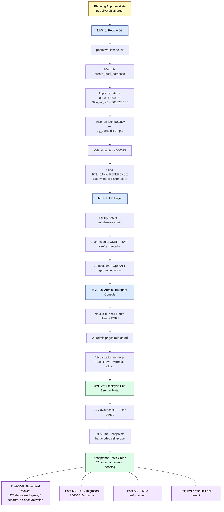

# Bootstrap Execution Plan
## Heuresys Advanced — HRMS/BPM Platform v5

> **Status:** Planning deliverable #1 of 10 (Section 18). Awaiting user review/approval before Section 19 (heavy implementation) is unlocked.
> **Date:** 2026‑05‑16
> **Source of Truth:** `docs/source_bundle/extracted_bootstrap/` (v5 Bootstrap Pack) — canonical target architecture.
> **Brownfield enrichment source:** `docs/source_bundle/brownfield/db-export.zip` (legacy `heuresys_platform` PostgreSQL 16 DB, 576 business tables, 16 domains).

---

## 1. Purpose

This document is the top‑level execution roadmap from the **planning approval gate** to **acceptance tests green**. It binds together the other 9 planning deliverables, records architectural decisions through ADRs, defines the MVP roadmap (MVP‑0 → MVP‑1 → MVP‑2), maps every acceptance test to the artifact that satisfies it, and consolidates the risk register.

After this document is approved, Section 19 of the user prompt is unlocked: repository scaffold, migrations, API, frontend, validation. Until then, no code, no migration DDL, no scaffold, no Docker.

---

## 2. Non‑Negotiable Architectural Invariants

The platform is **tenant‑aware**, **authenticated**, **position‑centric**, and **BPM‑aware**. The invariants below cannot be changed without re‑opening this plan.

| # | Invariant | Source |
|---|-----------|--------|
| I1 | Central HRMS object is **Position**, not Employee. Users are *assigned* to positions through `sys.sys_user_position_assignments` (history, primary/secondary/interim, FTE, status). | `AI_CODING_AGENT_BOOTSTRAP_PROMPT.md` §1.1 |
| I2 | **Position owner ≠ Position incumbent.** Owner sits on `sys.sys_positions.position_owner_user_id`. Incumbent sits in `sys.sys_user_position_assignments`. | `DBMS_BOOTSTRAP_SPEC.md` §313 |
| I3 | **Canonical schema = `sys`.** All canonical application tables are `sys.sys_<plural>`. Never `public`, `heuresys`, `br_*` (table prefix), `usr_*`. | `DBMS_BOOTSTRAP_SPEC.md` §36‑76 |
| I4 | **Auxiliary schemas (non‑canonical):** `brownfield`, `staging`, `audit` exist strictly for import staging, candidate validation, lineage records and import audit logs. They never receive canonical application data. | This plan §1 design rule |
| I5 | **Tenant isolation = FK + API‑level filter. No RLS.** Every query in `apps/api` carries `tenantId` via JWT claim; repositories enforce it. | `DBMS_BOOTSTRAP_SPEC.md` §78 |
| I6 | **Tenant FK:** `sys.sys_users.user_tenant_id → sys.sys_tenancies.tenant_id`. | `AI_CODING_AGENT_BOOTSTRAP_PROMPT.md` §1.2 |
| I7 | **Auth separation:** plaintext passwords never stored; `sys.sys_users` is the person anchor, not the auth credential store. Auth uses 11 dedicated tables in `sys`. | `AUTH_STACK_SPEC.md` |
| I8 | **Out of scope (excluded from canonical):** payroll execution, T&A, benefits, procurement, IAM/badge, facilities, medical/anamnestic, raw PII, raw SAP HR, RLS policies, runtime sessions. | `SECURITY_AND_PRIVACY_BOUNDARIES.md` |
| I9 | **Position Intelligence Profile = view, not blob.** Relational base tables + `VIEW`/`MATERIALIZED VIEW` projection. JSONB allowed only for unstructured AI hints / visualization metadata / external payloads. | `TARGET_SCHEMA_DESIGN.md` formal rule |
| I10 | **Visualization layer = renderer‑neutral projection.** Semantic graph (`nodes`, `edges`) is canonical. Layout edits update `sys_visualization_node_layouts` coordinates only; never mutate semantic hierarchy. | `GRAPH_VISUALIZATION_MODEL_SPEC.md`, formal rule in `TARGET_SCHEMA_DESIGN.md` |
| I11 | **Training completion ≠ skill mastery.** Completion is *evidence*. Mastery requires reassessment. | `LEARNING_CATALOG_AND_GAP_CLOSURE_SPEC.md` |
| I12 | **Brownfield rule:** old DBMS (legacy heuresys-evo Docker) is the **authoritative no-PII data source**; v5 `sys.*` is the structural authority and wins on every conflict (ADR-0023); every brownfield‑sourced canonical record carries a `sys.sys_source_lineage_records` row. | `BROWNFIELD_IMPORT_STRATEGY.md` |
| I13 | **Local runtime: PostgreSQL 16 installed natively. No Docker, no containers.** Hosting *location* is deferred per ADR‑0010: localhost / OCI VM / OCI Managed. DB name `heuresys_advanced`, role `heuresys`, schema `sys` invariant. | User policy + ADR‑0010 |
| I14 | **No synthetic-vs-real dichotomy (ADR-0026).** The legacy data source is synthetic-by-provenance (ADR-0023) but is **treated as real production data**. The original `RTL_BANK_REFERENCE` synthetic scaffold was replaced by **real legacy-wired users** (S950 rebuild); the former `user_is_synthetic` flag + `SYNTHETIC_REFERENCE` user_type were **retired by migration 000154** (placeholder incumbents from tenant-materialization are now `user_type = GENERATED_INCUMBENT`). | `DBMS_BOOTSTRAP_SPEC.md` §365 |

---

## 3. Stack Decisions and ADR Appendix

All architectural decisions are formalized as ADRs under `docs/architecture/adr/`. The index lives at `docs/architecture/ADR_INDEX.md`. Each ADR records: **context**, **decision**, **alternatives considered**, **consequences**, **status**.

| ADR | Title | Decision | Status |
|-----|-------|----------|--------|
| [0001](architecture/adr/0001_monorepo_tool_pnpm.md) | Monorepo manager | **pnpm workspaces** | Accepted |
| [0002](architecture/adr/0002_backend_framework_fastify.md) | Backend framework | **Fastify 4** | Accepted (overridable in review) |
| [0003](architecture/adr/0003_db_access_drizzle_plus_raw_sql.md) | DB access strategy | **Drizzle ORM + raw `*.sql` migrations applied via `psql`** | Accepted (overridable) |
| [0004](architecture/adr/0004_no_docker_native_postgresql.md) | Runtime: no Docker | **Native PostgreSQL 16 only**; Docker excluded from canonical path | Accepted (hard user policy) |
| [0005](architecture/adr/0005_password_hashing_argon2id.md) | Password hashing | **Argon2id** (64 MiB / 3 / 4 — OWASP 2024) | Accepted |
| [0006](architecture/adr/0006_auth_strategy_jwt_plus_httponly_cookie.md) | Auth strategy | **15‑min JWT (RS256) + 30‑day refresh, single‑use rotation, `HttpOnly` + `Secure` + `SameSite=Lax` cookie + CSRF double‑submit** | Accepted |
| [0007](architecture/adr/0007_frontend_next15_app_router.md) | Frontend framework | **Next.js 15 App Router + React 19 + Tailwind 4 + shadcn/ui + TanStack Query v5 + RHF + Zod** | Accepted |
| [0008](architecture/adr/0008_position_intelligence_profile_as_view.md) | Position Intelligence Profile | **Relational base tables + `VIEW`/`MATERIALIZED VIEW`**; JSONB only for unstructured hints | Accepted |
| [0009](architecture/adr/0009_visualization_node_layouts_separate_table.md) | Visualization coordinates | **Dedicated `sys.sys_visualization_node_layouts`** for per‑layout/version coordinates | Accepted |
| [0010](architecture/adr/0010_postgresql_runtime_location.md) | PostgreSQL runtime location | **Option B — OCI VM `oracle-vm-default`** via SSH tunnel `-L 5433:localhost:5432`; A and C remain `.env` fallback blocks | Accepted |
| [0011](architecture/adr/0011_ess_scope_inclusion.md) | Employee Self‑Service Portal inclusion | **ESS in scope as MVP‑2b** (13 pages + 18 `/v1/me/*` endpoints + 19 `self`‑scope permissions + hard‑coded `userId = req.user.userId`) | Accepted |

> Decision Log table (chronological) sits at the foot of this file (§9).

### 3.1 Stack at a glance

```
Backend:
  - Node.js 20 LTS
  - TypeScript 5.x
  - Fastify 4 + fastify-jwt + fastify-cookie + fastify-helmet
  - Drizzle ORM (queries) + raw `*.sql` migrations
  - Zod 3 (shared via packages/shared)
  - Argon2id (password hashing)
  - pino (structured logging)
  - vitest + supertest

Frontend:
  - Next.js 15 App Router + React 19
  - Tailwind CSS 4 + shadcn/ui
  - TanStack Query v5
  - React Hook Form + zodResolver
  - React Flow (graph rendering) + Mermaid (fallback)
  - playwright (e2e smoke)

Database:
  - PostgreSQL 16 (native; no Docker)
  - Database: heuresys_advanced
  - Canonical schema: sys
  - Auxiliary schemas: brownfield, staging, audit
  - Runtime location: deferred (ADR-0010)

Tooling:
  - pnpm 9 workspaces
  - Node 20 LTS (>= 20.11)
  - PowerShell + Bash setup scripts
  - Python 3.12 (brownfield inspection only)
```

---

## 4. Repository Layout

See `REPOSITORY_STRUCTURE.md` for the source spec. The bootstrap target is:

```
heuresys-advanced/
├── package.json                          # workspace root
├── pnpm-workspace.yaml
├── tsconfig.base.json
├── .env.example                          # 3 commented blocks (A/B/C runtime — ADR-0010)
├── .gitignore                            # written at Task 1 of execution sequence
├── README.md
├── apps/
│   ├── api/                              # Fastify + Drizzle (MVP-1)
│   └── web/                              # Next.js 15 App Router (MVP-2)
├── packages/
│   └── shared/                           # Zod schemas + types (shared client+server)
├── db/
│   ├── migrations/                       # 27 idempotent *.sql files (MVP-0): 26 legacy v5 skeletons + 000027 ESS (ADR-0011)
│   ├── seeds/                            # CSV + idempotent INSERTs
│   └── scripts/                          # native PostgreSQL setup (PowerShell + Bash)
├── tests/{db,api,e2e}                    # vitest + supertest + playwright
├── qa_artifacts/                         # acceptance test outputs
└── docs/
    ├── source_bundle/                    # canonical bootstrap pack (read-only)
    ├── BOOTSTRAP_EXECUTION_PLAN.md       # this file
    ├── architecture/{ADR_INDEX.md, adr/0001..0010_*.md}
    ├── db/{TARGET_SCHEMA_DESIGN.md, MIGRATION_IMPLEMENTATION_PLAN.md}
    ├── brownfield/                       # 4 deliverables + gitignored _inspection_artifacts/
    ├── security/AUTH_SECURITY_PLAN.md
    ├── frontend/FRONTEND_IMPLEMENTATION_PLAN.md
    └── api/API_IMPLEMENTATION_PLAN.md
```

---

## 5. MVP Roadmap

The bootstrap is layered into three milestones, each gated by acceptance tests. Heavy implementation begins after this plan and its 9 siblings are approved.

### MVP‑0 — Repository + Database (≈ 1 focused week)

**Goal:** working repository scaffold + PostgreSQL schema with 27 idempotent migrations + reference seed.

| Step | Deliverable | Acceptance |
|------|-------------|------------|
| 5.0.1 | Initialize `package.json` + `pnpm-workspace.yaml` + `tsconfig.base.json` + `.env.example` | `pnpm install` succeeds |
| 5.0.2 | Create `db/scripts/{create_local_database,migrate,reset_local_database,validate_database}.{ps1,sh}` reading `.env` | Scripts idempotent on second run |
| 5.0.3 | Write 27 `db/migrations/000001..000027.sql` per `MIGRATION_IMPLEMENTATION_PLAN.md` (000001‑000026 legacy v5 + 000027 ESS per ADR‑0011) | All tables in `sys`, auxiliary in `brownfield`/`staging`/`audit` |
| 5.0.4 | Create `sys.sys_schema_migrations` audit table; record each apply | Audit row present per migration |
| 5.0.5 | Apply migrations twice, capture `pg_dump --schema-only` snapshots, diff | Empty diff |
| 5.0.6 | Run validation views (`000023`) | All checks return 0 violations |
| 5.0.7 | Seed `RTL_BANK_REFERENCE` (158 deterministic Faker‑generated reference users, 5 branches, 25 branch positions) via `db/scripts/seed-reference-bank.ts`. **This is the reference fixture, separate from the brownfield import.** The brownfield import (post‑MVP) brings ~270 demo employees across 4 legacy tenants (RTL Bank 158, SmartFood 82, EcoNova 26, Heuresys System 4) and can coexist with the seed under distinct tenant codes. Legacy data is demo (no real PII) generated by the platform owner; anonymization is therefore not required and the data is treated as real (ADR-0026 — no synthetic flag, retired by 000154). | Reference tenant exists, users seeded with `user_type = STANDARD` |

### MVP‑1 — API Layer (≈ 1‑2 focused weeks)

**Goal:** Fastify server with 22 modules, all tenant‑aware, exposing the OpenAPI contract (+ gap remediation).

| Step | Deliverable | Acceptance |
|------|-------------|------------|
| 5.1.1 | `apps/api/src/server.ts` + plugin order per `API_IMPLEMENTATION_PLAN.md` | `pnpm --filter api dev` starts |
| 5.1.2 | Middleware: requestId, JWT decode → tenant context, RBAC, Zod validation, error envelope | `GET /healthz` returns 200 |
| 5.1.3 | Auth module: `POST /auth/login`, `POST /auth/refresh`, `POST /auth/logout`, `GET /auth/me`, password reset, CSRF middleware, refresh‑rotation with replay detection | `AUTH_SECURITY_PLAN.md` Acceptance checklist green |
| 5.1.4 | 21 remaining modules (tenants, users, user‑profiles, user‑position‑assignments, enterprise‑typing, blueprints, bpm‑processes, organization‑units, positions, job‑roles, skills, kpis, learning, training‑initiatives, assessments, gap‑analysis, career‑succession, compensation‑intelligence, visualizations, seed‑acquisition, brownfield‑adaptation) | Each module: routes + service + repo + Zod schema + vitest unit + supertest integration test |
| 5.1.5 | OpenAPI gap remediation: add POST/PATCH/DELETE for positions/skills/kpis/learning/gaps | OpenAPI contract regenerated and committed |

### MVP‑2 — Frontend (≈ 4‑5 focused weeks, split in 2 sub‑phases)

**Goal:** Next.js frontend covering both **(a) Admin/Blueprint Console** (23 pages, manager‑oriented) and **(b) Employee Self‑Service Portal** (13 pages, employee‑oriented). All role‑gated; both share the same authentication and Layout shell, but with different navigation skins per role.

#### MVP‑2a — Admin / Blueprint Console (≈ 2‑3 focused weeks)

| Step | Deliverable | Acceptance |
|------|-------------|------------|
| 5.2.1 | `apps/web/` skeleton (Next 15 App Router) + root + admin layouts | `pnpm --filter web dev` serves `/login` |
| 5.2.2 | Auth client: cookie session, refresh on 401, redirect on session expiry, CSRF token wiring | Manual login → dashboard succeeds |
| 5.2.3 | 23 admin pages per `FRONTEND_IMPLEMENTATION_PLAN.md` route map (admin section) | Every page renders with seeded data, role gate enforced |
| 5.2.4 | Visualization renderer: React Flow for org chart, process flow, career path, learning path, skill gap map, succession map | `/visualizations/{id}` renders graph from `sys_visualization_*` |
| 5.2.5 | Playwright smoke tests: admin login → tenant list → position detail → gap dashboard | All e2e admin tests green |

#### MVP‑2b — Employee Self‑Service Portal (≈ 2 focused weeks)

**Goal:** every authenticated `USER` (i.e. not just managers/admins) has a personalized portal to view and act on **their own** position, skills, learning, KPIs, career path and gap. All endpoints scope‑filtered to `self`; no cross‑user visibility.

| Step | Deliverable | Acceptance |
|------|-------------|------------|
| 5.2.6 | ESS layout shell + sidebar filtered for `USER` role + landing at `/me` after login (if user holds only `USER` role, redirect from `/dashboard` to `/me`) | `USER` login lands on `/me`; admins land on `/dashboard` |
| 5.2.7 | 13 ESS pages per `FRONTEND_IMPLEMENTATION_PLAN.md` ESS section: `/me` (My HR landing), `/me/profile`, `/me/positions`, `/me/skills`, `/me/skills/self-assessment`, `/me/learning`, `/me/learning/catalogue`, `/me/kpis`, `/me/gaps`, `/me/career`, `/me/certifications`, `/me/documents`, `/me/inbox` | Every ESS page renders for a seeded `USER`; scope‑filter test: user A cannot see user B's data via direct URL manipulation |
| 5.2.8 | Self‑service mutations: profile edit, learning self‑enrollment, skill self‑assessment, certification upload (URI only, no binary), career target request | Each mutation hits API with `self`‑scoped permission; writes lineage row in `audit.user_self_service_actions` |
| 5.2.9 | API extensions: `GET /v1/me/*`, `PATCH /v1/me/profile`, `POST /v1/me/learning/enrollments`, `POST /v1/me/skills/self-assessments`, `POST /v1/me/career/target-positions`, `POST /v1/me/documents` (URI metadata) — all with implicit `userId = req.user.userId` enforcement | Cross‑user attempt returns 403 (or 404 to prevent enumeration); positive test green |
| 5.2.10 | Playwright smoke tests: USER login → /me → request training → submit self‑assessment → logout | All e2e ESS tests green |

**Scope clarifications for ESS:**

- **In scope (MVP‑2b)**: position/skills/learning/KPIs/gap/career visibility for self + a curated set of self‑service mutations.
- **Out of scope (deferred post‑MVP)**: payroll views, attendance/leave requests, expense reports, performance review self‑editing, peer feedback flows, manager 1:1 scheduling, in‑app messaging.
- A `USER` cannot access any admin route (`/dashboard`, `/tenants/...`, `/positions/...`, etc.); the layout guards both server‑side (in `(admin)/layout.tsx`) and client‑side (sidebar filter).
- A user holding both `USER` and `MANAGER`+ roles sees a top‑bar switch to toggle between "My HR" (ESS) and "Admin" views.

### Post‑MVP (out of bootstrap scope)

- Brownfield wave execution (Wave 1‑4) against approved adaptation map.
- MFA enforcement.
- Rate limiting per‑user.
- Optional Docker reference under `docs/optional/docker/` (only if a contributor opts in).
- Eventual migration localhost → OCI VM (ADR‑0010 closure).

---

## 6. Acceptance Test Coverage Matrix

Maps every test in `bootstrap_agent/checklists/ACCEPTANCE_TESTS.md` to the artifact that satisfies it. The legacy Docker test is replaced by the native PostgreSQL connection test.

| ID | Acceptance Test | Satisfied By | Deliverable |
|----|-----------------|--------------|-------------|
| A1 | Repository structure exists | `pnpm-workspace.yaml` + `apps/` + `packages/` + `db/` | MVP‑0.5.0.1 |
| A2 | ~~Docker Compose starts PostgreSQL~~ → **PostgreSQL connection succeeds against `.env`‑configured runtime** | `db/scripts/validate_database.{ps1,sh}` | MVP‑0.5.0.2, ADR‑0010 |
| A3 | Migrations run twice idempotently | `pg_dump --schema-only` diff empty | MVP‑0.5.0.5 |
| A4 | `sys` schema exists | `000002_init_sys_schema.sql` | MVP‑0.5.0.3 |
| A5 | `sys.sys_tenancies` exists | `000003_tenancies.sql` | MVP‑0.5.0.3 |
| A6 | `sys.sys_users` exists | `000004_users.sql` | MVP‑0.5.0.3 |
| A7 | `user_tenant_id` FK works | `000004_users.sql` + 000023 validation view | MVP‑0.5.0.3, 5.0.6 |
| A8 | Auth tables exist | `000005_auth_foundation.sql` | MVP‑0.5.0.3 |
| A9 | Profile/evidence tables exist | `000006_user_profiles_and_evidence.sql` | MVP‑0.5.0.3 |
| A10 | Positions + assignments exist | `000011_position_model.sql`, `000012_user_position_assignments.sql` | MVP‑0.5.0.3 |
| A11 | Seed acquisition staging exists | `000020_seed_acquisition_staging.sql` | MVP‑0.5.0.3 |
| A12 | Visualization graph tables exist (incl. `sys_visualization_node_layouts`) | `000022_visualization_graph_model.sql` | MVP‑0.5.0.3 + ADR‑0009 |
| A13 | Brownfield staging/lineage tables exist | `000024_brownfield_import_staging.sql`, `000025_brownfield_lineage_and_mapping.sql`, `000026_brownfield_import_validation.sql` | MVP‑0.5.0.3 |
| A14 | Reference tenant exists | `db/scripts/seed-reference-bank.ts` | MVP‑0.5.0.7 |
| A15 | Process files 00–22 validate | reuse of v5 bundle | already validated (`VALIDATION_RESULT.json` status OK) |
| A16 | API starts | `apps/api/src/server.ts` | MVP‑1.5.1.1 |
| A17 | Frontend starts | `apps/web/` | MVP‑2.5.2.1 |
| A18 | `/auth/me` works | auth module | MVP‑1.5.1.3 |
| A19 | `/tenants` works | tenants module | MVP‑1.5.1.4 |
| A20 | `/users` works | users module | MVP‑1.5.1.4 |
| A21 | `/positions` works | positions module | MVP‑1.5.1.4 |
| A22 | `/visualizations` works | visualizations module | MVP‑1.5.1.4 |
| A23 | Brownfield adaptation map generated | `BROWNFIELD_ADAPTATION_MAP.md` + `_inspection_artifacts/tables_with_domains.csv` | already produced as part of this planning phase |

---

## 7. Sequence Diagram (Bootstrap Dependencies)

**Rendered artifacts** (regenerable from the `.mmd` source via `mmdc` — see `qa_artifacts/diagrams/bootstrap_mvp_flow.mmd` header for the exact command):

- Source `qa_artifacts/diagrams/bootstrap_mvp_flow.mmd`
- PNG `qa_artifacts/diagrams/bootstrap_mvp_flow.png` (≈ 48 KB, for slide decks)
- SVG `qa_artifacts/diagrams/bootstrap_mvp_flow.svg` (≈ 42 KB, vector for high‑res / web)



---

## 8. Risk Register (cross‑referenced)

References this plan’s §8 (master risk register). Key risks impacting execution:

| ID | Risk | Mitigation in this plan |
|----|------|-------------------------|
| R1 | 26 v5 migration skeletons empty + 1 new 000027 ESS migration → ~123 `CREATE TABLE` to author | Per‑file DDL blueprint in `MIGRATION_IMPLEMENTATION_PLAN.md` §3; one focused session per domain group; 000027 is small (2 tables + extends 1 view) |
| R2 | Brownfield import correctness (low risk: legacy is owner‑generated demo, no real PII; out‑of‑scope tables still excluded by functional scope I8). Risk now is mainly **scope drift** (importing tables the new platform has no consumer for) rather than privacy. | Rule‑based classifier (`tables_with_domains.csv`) + functional‑scope check via `BROWNFIELD_EXCLUSION_REPORT.md`. Column‑level PII filter from `BROWNFIELD_TABLE_CLASSIFICATION_REPORT.md` §4.2 kept as defensive policy for any **future** real‑data import. |
| R3 | OpenAPI contract read‑only for positions/skills/kpis/learning | MVP‑1.5.1.5 dedicated step adds POST/PATCH/DELETE; documented in `API_IMPLEMENTATION_PLAN.md` |
| R4 | Idempotency at ~123 tables × 27 migrations × twice‑run | Standard `IF NOT EXISTS` pattern + `DROP CONSTRAINT IF EXISTS ; ADD CONSTRAINT` for CHECKs; `validate_database.ps1` runs twice + pg_dump diff |
| R5 | PIP aggregate design | Resolved → relational base + `VIEW`/`MV`; ADR‑0008 |
| R6 | Viz layout coordinate collisions | Resolved → dedicated `sys_visualization_node_layouts`; ADR‑0009 |
| R7 | 158 reference users plausible distribution | Deterministic Faker seed in `seed-reference-bank.ts`; `user_type = STANDARD` (synthetic flag retired by 000154) |
| R8 | Stack assembly on Windows host | Node 20 LTS + pnpm 9; PostgreSQL native (ADR‑0004); runtime location deferred (ADR‑0010) |
| R9 | Brownfield extraction must not be committed | `.gitignore` Task 1 hard requirement (already applied at `D:\heuresys-advanced\.gitignore`) |
| R10 | FIN_BANKING reward gates (7) on a generic framework | `sys.sys_reward_gate_catalog` keyed by `industry_blueprint_code`; framework stays generic |
| R11 | Token budget on writing 10 large markdown files | Files independent; produce one at a time, check‑in between |
| R12 | **Bus factor 1** (single contributor: Enzo). Repository, ADR set, deliverable docs, brownfield knowledge concentrated in one person. If interrupted, continuity risk is high. | Mitigations already in place: (a) every architectural decision is in a versioned ADR file under `docs/architecture/adr/` — readable by any successor; (b) the 10 planning deliverables are self‑contained (no implicit knowledge); (c) `BROWNFIELD_*` files capture demo data nature and import strategy explicitly; (d) ADR‑0010 keeps runtime location switchable via `.env` so a successor doesn't inherit a specific OCI tunnel setup; (e) commits should include `Co‑Authored‑By` trailers when AI‑assisted (CLAUDE.md regola 17). |
| R13 | **OCI ARM64 native deps**: Argon2, `pg`, drizzle and other Node native modules must build on `aarch64`. The OCI Free Tier VM is ARM64; some npm prebuilt binaries lack ARM64 wheels and fall back to compile from source (needs `build-essential`, `python3`, `node-gyp`). On ADR‑0010 location B (OCI VM) the API runtime hits this. | (a) Verify prebuilt ARM64 wheels for Argon2 0.31+, `pg` 8.x, Drizzle: at least Argon2 has them since v0.30; (b) If a dep lacks ARM64 binary, document `apt install build-essential python3 g++ make` as prereq for VM provisioning; (c) Run an end‑to‑end `pnpm install && pnpm test` on `oracle-vm-default` before committing to location B in ADR‑0010 closure; (d) Fallback: keep API on Windows host + DB on VM (mixed setup) if native build proves problematic. |
| R14 | **Bleeding‑edge stack** (Next.js 15, React 19, Tailwind 4) may have unresolved bugs or breaking changes in minor releases. Some shadcn/ui primitives may not yet support React 19 server components. | (a) Pin exact patch versions in `package.json` (`"next": "15.0.3"` not `"^15.0.0"`); (b) Watch Next.js + React 19 changelogs during MVP‑2 sprint; (c) `pnpm overrides` to lock transient deps; (d) If a primitive breaks, fall back to a manual implementation rather than chase upstream fix; (e) Acceptable downgrade plan documented in ADR‑0007: Next 14 + React 18 + Tailwind 3 as a known‑stable fallback. |
| R15 | **ESS scope expansion** (MVP‑2b just added) adds ≈2 weeks to MVP‑2 and introduces self‑scope permission complexity (`user_profile:update:self`, `learning:enroll:self`, etc.). Risk of overlap with admin permissions if the repository pattern leaks. | (a) ESS endpoints live under `/v1/me/*` prefix with hard‑coded `userId = req.user.userId` (never reads userId from URL); (b) RBAC middleware extension: `requireSelfScope()` decorator on ESS routes; (c) ESLint rule extension to flag any repository call from `/v1/me/*` that uses an argument other than `req.user.userId`; (d) E2E test (5.2.7 acceptance): user A attempts `GET /v1/users/{B.id}` and `GET /v1/me/profile` while impersonating A; A must get B as 404 and his own profile as 200; (e) Sub‑phase MVP‑2b is sequential **after** MVP‑2a so admin patterns are settled first. |

---

## 9. Decision Log

| Date | ADR | Title | Decision | Status |
|------|-----|-------|----------|--------|
| 2026‑05‑16 | 0001 | Monorepo tool | pnpm workspaces | Accepted |
| 2026‑05‑16 | 0002 | Backend framework | Fastify 4 | Accepted |
| 2026‑05‑16 | 0003 | DB access | Drizzle ORM + raw SQL migrations | Accepted |
| 2026‑05‑16 | 0004 | Runtime | Native PostgreSQL only — no Docker on canonical path | Accepted (user policy) |
| 2026‑05‑16 | 0005 | Password hashing | Argon2id (64 MiB / 3 / 4) | Accepted |
| 2026‑05‑16 | 0006 | Auth strategy | JWT 15min + refresh 30d rotated + cookie + CSRF | Accepted |
| 2026‑05‑16 | 0007 | Frontend | Next 15 App Router + React 19 + Tailwind 4 + shadcn/ui | Accepted |
| 2026‑05‑16 | 0008 | PIP design | Relational + View, not blob | Accepted |
| 2026‑05‑16 | 0009 | Viz coordinates | Dedicated `sys_visualization_node_layouts` table | Accepted |
| 2026‑05‑16 | 0010 | PostgreSQL runtime location | Option B — OCI VM `oracle-vm-default` via SSH tunnel on port 5433 | Accepted |
| 2026‑05‑16 | 0011 | Employee Self‑Service Portal inclusion | ESS in scope as MVP‑2b (reverses original out‑of‑scope) | Accepted |

### 9.1 Review Session Decisions (Review #1‑#11, 2026‑05‑16)

The deliverable review session produced additional binding decisions, recorded below for traceability. These are not formal ADRs (they update existing ADRs or planning documents in place), but they shape the final state of the 10 + 1 deliverables.

| # | Topic | Decision |
|---|-------|----------|
| RD‑01 | Database name | Renamed `company_hrms_bpm` → `heuresys_advanced` (21 occurrences across 6 files); role renamed `company_hrms` → `heuresys` (26 occurrences across 5 files) |
| RD‑02 | Brownfield data nature | Confirmed: legacy `heuresys_platform` contains owner‑generated demo data (no real PII). Anonymization no longer required for Wave 3; exclusion rationale reframed from "privacy/PII" to "functional scope I8" |
| RD‑03 | Brownfield scope | 4 tenant in legacy (RTL Bank 158, SmartFood 82, EcoNova 26, Heuresys System 4); 270 employees / 274 users imported as `user_type = STANDARD` (no synthetic flag — retired by 000154/ADR-0026) |
| RD‑04 | ESS inclusion (ADR‑0011) | ESS in scope as MVP‑2b: 13 pages `/me/*` + 18 endpoints `/v1/me/*` + 19 `self`‑scope permissions + hard‑coded `userId = req.user.userId` + ESLint rule + audit table |
| RD‑05 | Argon2id parameters (ADR‑0005) | Confirmed bilanciato 64 MiB / 3 / 4 (OWASP 2024) |
| RD‑06 | Cookie SameSite (ADR‑0006) | Confirmed `SameSite=Lax` |
| RD‑07 | `auth:revoke_user` permission | Added to role × permission matrix (`AUTH_SECURITY_PLAN.md` §6): PLATFORM_ADMIN + TENANT_ADMIN (own tenant) |
| RD‑08 | Categorical fields | varchar(N) + CHECK constraint preferred over PostgreSQL ENUM type (per `TARGET_SCHEMA_DESIGN.md` §0.6) |
| RD‑09 | Date columns | `date` PostgreSQL type for date‑only columns; `timestamptz` only where time precision required |
| RD‑10 | `sys.sys_inbox_notifications` + `audit.user_self_service_actions` | Added to canonical schema (ADR‑0011 follow‑up); migration `000027_ess_inbox_and_audit.sql` created; sizing updated to 123 sys + 10 views + 10 aux |
| RD‑11 | Migration count | 27 migrations total (26 legacy v5 + 1 new ESS) |
| RD‑12 | Frontend i18n | Bilingual `it` (default) + `en` from MVP‑2 (promoted from post‑MVP) via `next-intl`; parity discipline + CI check |
| RD‑13 | React Flow attribution | `hideAttribution: true` retained with explicit Pro license warning; ADR‑0012 to be opened before commercial production deployment |
| RD‑14 | `READ_ONLY` only landing | Redirect to `/me` (view‑only mode); not `/dashboard` (manager‑oriented) |
| RD‑15 | API performance budget | P99 PIP view 600 ms (conservative) with MATERIALIZED VIEW fallback rule (ADR‑0008 follow‑up) |
| RD‑16 | DB connection pool | 20 connections (dev / shared host); production tuning post‑MVP |
| RD‑17 | Risk register (R12‑R15) | Added: R12 bus factor, R13 OCI ARM64 native deps, R14 bleeding‑edge stack, R15 ESS scope expansion |
| RD‑18 | Brownfield refresh procedure | Commit + PR mandatory; no auto‑update CI; snapshot diff committed to `qa_artifacts/brownfield/` |
| RD‑19 | DGOV REFERENCE_ONLY breakdown | 179 tables grouped in 16 sub‑categories (SAP HR cluster ≈ 95 is the dominant bucket) — see `BROWNFIELD_TABLE_CLASSIFICATION_REPORT.md` §3.12.1 |
| RD‑20 | Wave numeric reconciliation | Exact per‑wave counts (93 + 94 + 31 + 55 = 273 imported, 303 not imported, 576 catalog + 7 pre‑excluded = 583 raw) verified from CSV |
| RD‑21 | Promotion process | Mandatory 16‑step process to promote any table from EXCLUDE/REFERENCE_ONLY to IMPORT/TRANSFORM, covering CSV + 4 brownfield docs + TARGET_SCHEMA + MIGRATION_PLAN + new ADR + atomic PR |
| RD‑22 | Wave runner documentation | Step 9.0 added to `BROWNFIELD_IMPORT_PLAN.md` §9: per‑wave runner spec `docs/brownfield/wave_runners/wave_N_runner.md` to be written before runner implementation |
| RD‑23 | Mermaid diagram artifact | Bootstrap MVP flow diagram exported as PNG (48 KB) + SVG (42 KB) under `qa_artifacts/diagrams/` |
| **RD‑24** | **Formal approval gate** | **2026‑05‑16, end of Review session #1‑#11: Enzo Spenuso formally approves all 10 Section 18 deliverables + ADR‑0011 (ESS) + Mermaid artifact. Section 19 (heavy implementation: MVP‑0 repo scaffold + migrations + API + frontend) is hereby unlocked. Next session resumes from MVP‑0 step 5.0.1 (pnpm workspace init).** |
| **RD‑25** | **ADR‑0010 closure** | **2026‑05‑16, opening of MVP‑0 implementation session: Enzo selects **Option B** — PostgreSQL 16 native on OCI VM `oracle-vm-default` reached via SSH local‑forward tunnel on port **5433** (`ssh -L 5433:localhost:5432 oracle-vm-default`). ADR‑0010 status moves from `Open` to `Accepted`. Options A (localhost) and C (OCI Managed) remain documented as commented fallback blocks in `.env.example`. Risk R13 (OCI ARM64 native deps) becomes active and must be verified at first `pnpm install`. |

---

## 10. Open Questions for User Review — **ALL RESOLVED post-RD-24 (2026-05-16) + post-MVP-3 (2026-05-25)**

> **Status update 2026-05-26 (Pre-flight Phase 1 DOC-10)**: tutte le Q1-Q8 originali sono state risolte durante MVP-0..3. Tabella aggiornata per archive storico.

| # | Question | Resolution | ADR/RD ref |
|---|----------|------------|------------|
| Q1 | Confirm Fastify over Express? | ✅ **RESOLVED 2026-05-16**: Fastify 4 confirmed → Fastify 5 post-triage fase 2 (MVP-3) | ADR‑0002 Accepted |
| Q2 | Confirm Drizzle over node‑postgres? | ✅ **RESOLVED 2026-05-16**: Drizzle ORM as pool wrapper only; raw parametrized SQL on `pg` for query execution | ADR‑0003 Accepted |
| Q3 | DB name | ✅ **RESOLVED RD-01**: `heuresys_advanced` / role `heuresys` confirmed | RD-01 |
| Q4 | Final runtime location ADR‑0010 | ✅ **RESOLVED RD-25 (2026-05-16)**: **Option B** — OCI VM `oracle-vm-default` via SSH tunnel `5433→5432`. Option A/C documentati come `.env.example` fallback blocks. Option C future revisit pianificato in MVP-4 stream 2.8 (vedi `docs/MVP_4_ROADMAP.md`) | ADR‑0010 Accepted (RD-25) |
| Q5 | OCI VM PostgreSQL access | ✅ **RESOLVED RD-25**: SSH tunnel pattern shipped + funzionante; `ssh -fN -L 5433:localhost:5432 oracle-vm-default` come canonical command | ADR‑0010 |
| Q6 | Synthetic data generator | ✅ **RESOLVED**: Deterministic Faker `SEED=42` confermato + shipped in `db/scripts/seed-reference-bank.ts`. 158 users sintetici + 55 positions generate ripetibilmente | `MIGRATION_IMPLEMENTATION_PLAN.md` + `db/scripts/` |
| Q7 | Brownfield wave order | ✅ **RESOLVED**: Wave 1 → Wave 2-4 confermato. Wave 1 shipped MVP-3 Tappa D pragmatic 13/19 IMPORT (CW-B60 residual). Wave 2/3/4 docs runner scritte in MVP-4 stream 2.1/2.2/2.3 (vedi `docs/brownfield/wave_runners/`) | `BROWNFIELD_IMPORT_PLAN.md` + `wave_runners/` |
| Q8 | OpenAPI contract location | ⚠️ **PARTIALLY RESOLVED**: decision confirmed (`apps/api/openapi.yaml`), MA file non ancora generato — `openapi:generate` script in package.json punta a `scripts/generate-openapi.ts` non esistente. **Pending implementation** in Pre-flight Phase 3 CODE-2 (cleanup o riscrittura generator) | `API_IMPLEMENTATION_PLAN.md` §13 |

**Section 19 (heavy implementation) unlocked**: 2026-05-16 (RD-24 approval). Tutte le 10 deliverables planning approved.

---

## 11. Verification Checklist (before declaring this deliverable complete)

- [x] Architectural invariants enumerated (§2)
- [x] ADR appendix referenced (§3) and 10 ADR files planned at `docs/architecture/adr/000N_*.md`
- [x] Repository layout consistent with `REPOSITORY_STRUCTURE.md` (§4)
- [x] MVP‑0/1/2 roadmap with acceptance criteria per step (§5)
- [x] Acceptance test coverage matrix maps every test to a step (§6)
- [x] Sequence diagram captures dependencies (§7)
- [x] Risk register cross‑referenced (§8)
- [x] Decision log table present (§9)
- [x] Open questions for user listed (§10)
- [x] No Docker references on canonical path (grep `docker` in this file: only mentions are explicit exclusions/optional path under `docs/optional/docker/`)
- [x] Schema policy applied: `sys` canonical, `brownfield`/`staging`/`audit` auxiliary

---

## 12. Next Steps (post user approval of all 10 planning deliverables)

1. Initialize repo scaffold (`pnpm init` + `pnpm-workspace.yaml` + `tsconfig.base.json`).
2. Write `db/scripts/create_local_database.{ps1,sh}`.
3. Write `db/migrations/000001..000027.sql` per `MIGRATION_IMPLEMENTATION_PLAN.md` (000027 = ESS inbox + audit per ADR‑0011).
4. Apply migrations against the runtime selected in ADR‑0010 closure.
5. Run twice‑run idempotency proof.
6. Seed `RTL_BANK_REFERENCE`.
7. Continue with MVP‑1 (API) and MVP‑2 (frontend) per §5.

> No code is written before the user approves the 10 deliverables. Until then, this is a plan, not a build.
