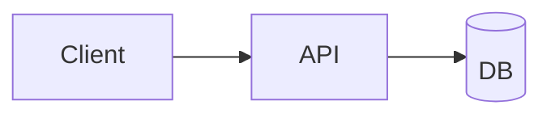

# 04 · README e Markdown su GitHub

> Il README.md è la "front door" di ogni repo: è il primo (e spesso unico) file letto dai visitatori. GitHub rende Markdown via la sua specifica GFM (GitHub-Flavored Markdown), con estensioni che vanno oltre CommonMark — saperle usare bene è gratis e ad alto impatto.

---

## 1. Concetto

GitHub renderizza file `.md` (e `.markdown`) come HTML in tutte le pagine: README del repo, README di sub-directory, file in `docs/`, descrizioni di issue/PR/release, Wiki, gist.

Il dialetto è **GFM = CommonMark + estensioni**. Le aggiunte rispetto a CommonMark standard:

| Feature GFM | Esempio sintassi | Risultato |
|---|---|---|
| **Tables** | `\| col1 \| col2 \|` + separator | Tabella |
| **Strikethrough** | `~~testo~~` | ~~testo~~ |
| **Task lists** | `- [x] done` / `- [ ] todo` | Checkbox renderizzati |
| **Autolinking URL** | `https://example.com` | Link cliccabile |
| **Fenced code with language** | ` ```ts ` | Syntax highlighting |
| **Footnotes** | `nota[^1]` + `[^1]: testo` | Note a piè di pagina |
| **Mermaid diagrams** | ` ```mermaid ` | Diagrammi flowchart/seq/gantt |
| **Math** | `$E=mc^2$` (inline) o `$$ ... $$` (block) | LaTeX MathJax |
| **Alerts** (callout) | `> [!NOTE]` / `> [!WARNING]` / `> [!TIP]` / `> [!IMPORTANT]` / `> [!CAUTION]` | Box colorati |

Heading auto-generano **anchor link**: `# Sezione Foo` → `#sezione-foo` (lowercase + dash). Utile per linkare punti precisi di un file lungo.

**Badge** (immagini SVG dinamiche da servizi come [shields.io](https://shields.io)) sono Markdown immagini standard, ma sono diventati una convenzione visiva per indicare:
- Build status (es. CI verde/rosso)
- Versione package npm/crates
- License
- Downloads
- Coverage
- Open issues

---

## 2. Modello mentale

La gerarchia dei posti dove Markdown viene renderizzato su GitHub:

```
   ┌─────────────────────────────────────────────────────────────┐
   │                       REPOSITORY                            │
   │  ┌───────────────────────────────────────────────────────┐  │
   │  │  README.md      ← mostrato sulla home del repo        │  │
   │  │  CONTRIBUTING.md ← linkato dalla "About" card         │  │
   │  │  CODE_OF_CONDUCT.md ← idem                            │  │
   │  │  SECURITY.md     ← idem (tab Security)                │  │
   │  │  LICENSE         ← idem (tab About)                   │  │
   │  │  docs/**/*.md    ← navigabili dalla code tab          │  │
   │  └───────────────────────────────────────────────────────┘  │
   │                                                             │
   │  Issues / PR / Discussions / Releases / Wiki                │
   │  body: tutti accettano GFM identico                         │
   └─────────────────────────────────────────────────────────────┘

   ┌────────────────────────────────────┐
   │  PROFILE  github.com/<username>    │
   │  README.md di Spen-Zosky/Spen-Zosky │
   │  ← mostrato in cima alla pagina    │
   └────────────────────────────────────┘
```

I file `<UPPERCASE_NAME>.md` "speciali" (README, CONTRIBUTING, CODE_OF_CONDUCT, SECURITY, SUPPORT, FUNDING.yml) sono cercati da GitHub nelle posizioni: `<root>/`, `.github/`, `docs/`. Il primo trovato vince.

---

## 3. Applicato ai nostri repo

### `heuresys-advanced/README.md` (esiste — creato oggi)

Stato attuale: README ricco con headline numbers, tech stack, monorepo tree, getting started, testing, invariants, roadmap, link a Storybook. ~230 righe. Già aggiornato dopo il deploy del Storybook su `ux-design-shared`.

Cose che potresti aggiungere:

- **Badge bar** in cima (sotto il titolo): build status (quando attiverai un workflow CI), license (quando aggiungerai LICENSE), Storybook link (è già nel body — un badge ne migliora il "above-the-fold").
- **Mermaid diagram** per il monorepo layout — più navigabile della tree ASCII.
- **GitHub-flavored alerts** per evidenziare i 9 invariant non-negoziabili (`> [!IMPORTANT]`).

### `ux-design-shared/README.md` (NON esiste — c'è solo `MANIFEST.md` + `SETUP.md`)

Il repo non ha un `README.md` di root. La home page di `github.com/Spen-Zosky/ux-design-shared` mostra quindi solo la lista file (niente "front door"). Quando GitHub si chiede "che cosa è questo repo?", non lo dice nessuno. **Priorità alta** creare un `README.md` minimale.

Contenuto suggerito (~50 righe):
1. Titolo + tagline (`Design system React per i progetti Heuresys`)
2. Storybook live link (`https://spen-zosky.github.io/ux-design-shared/`)
3. Stats (51 componenti, 122 stories)
4. Tech stack (React 19, Tailwind 4, Radix, Storybook 10)
5. Come consumarlo (`pnpm link:` da un repo client; in futuro `@spen-zosky/ui` da npm)
6. Come contribuire (`npm run storybook` + add story)
7. Link a `MANIFEST.md` per il catalogo dettagliato

### Profile README — `Spen-Zosky/Spen-Zosky` (NON esiste)

Non hai un profile README. Se lo creassi, apparirebbe in cima a `github.com/Spen-Zosky`. Per ora opzionale, ma di alto ROI per visibilità — un giorno (recruiting, sponsor, contributor) avere una pagina di "presentazione" che linka i due progetti pubblici fa la differenza.

---

## 4. Comandi / checklist

### Anatomia di un README forte

Ordine consigliato dall'alto:
1. **H1 = nome progetto** (1 sola riga)
2. **Tagline** (1-2 righe) — cosa è e perché esiste
3. **Badge bar** (opzionale, vedi sotto)
4. **Hero blockquote** con lo stato corrente (`> Status — version, last update, deploy URL`)
5. **TOC** se ≥6 sezioni
6. **Quick start** (3-5 step concreti)
7. **Architecture / Stack** (tabella o tree)
8. **Documentation** (link a `docs/**`)
9. **Testing**
10. **Contributing** (anche solo "open Issues for X, see CONTRIBUTING.md")
11. **License**
12. **Credits / Author**

### Esempi GFM utili

**Alert callout**:
```markdown
> [!NOTE]
> Esecuzione richiede SSH tunnel su porta 5433.

> [!WARNING]
> Mai committare `.env` — secret scanning blocca il push.

> [!IMPORTANT]
> Tenant isolation = FK + middleware filter. **Mai** Postgres RLS.
```

**Tabella di confronto**:
```markdown
| Feature | A | B |
|---|---|---|
| Speed | ✅ | ⚠️ |
| Cost | ❌ | ✅ |
```

**Task list (cliccabile su Issues/PR)**:
```markdown
- [x] Setup
- [x] Tests
- [ ] Deploy
```

**Code block con language hint** (syntax highlight):
````markdown
```typescript
const x: number = 42;
```
````

**Mermaid diagram**:
````markdown

````

**Anchor link interno**:
```markdown
Vedi la [sezione testing](#testing) per i dettagli.
```

**Collapsible section** (HTML — funziona in GFM):
```html
<details>
<summary>Vedi i dettagli</summary>

Contenuto nascosto di default. Il visitatore deve cliccare per espanderlo.

</details>
```

### Badge essenziali (shields.io)

Generatore di badge: <https://shields.io/badges>

Esempi pronti per i nostri repo:

```markdown
<!-- License -->


<!-- Last commit -->


<!-- Open issues -->


<!-- Workflow status -->


<!-- Custom link badge -->
[](https://spen-zosky.github.io/ux-design-shared/)
```

### Checklist nuovo file Markdown

- [ ] H1 al top (unico nel file).
- [ ] TOC se ≥5 sezioni.
- [ ] Code block con `language hint` (`bash`, `ts`, ecc.).
- [ ] Link interni relativi (`./file.md` o `../altra/file.md`).
- [ ] Link esterni in formato `[testo](url)` (no autolink se vuoi descriverli).
- [ ] Preview locale prima del push (VS Code: `Ctrl+Shift+V` su `.md`).

---

## 5. Trappole comuni

- **Heading anchor con caratteri speciali**: GitHub converte i heading in slug minuscoli con dash, **drop emoji e punteggiatura**. Quindi `# 🚀 MVP-2A IN-FLIGHT` diventa `#mvp-2a-in-flight` (senza emoji e con dash al posto di spazi). Verifica i link interni cliccandoci sopra.
- **Tabella con `|` nel contenuto**: bisogna escaparlo con `\|` o usare HTML entity `&#124;`. Altrimenti la tabella si rompe.
- **Mermaid che non renderizza**: deve essere ` ```mermaid ` esatto (no spazi extra) e la sintassi Mermaid valida — se sbagliata non renderizza, ma non mostra errore visibile sotto, devi indagare in console o tramite mermaid.live.
- **Immagini con percorso assoluto Windows** (`D:\foo\bar.png`): non vengono renderizzate. Usa percorso relativo (`./assets/foo.png`) o URL HTTPS pubblico.
- **README troppo lungo** (>500 righe): GitHub tronca con "View more" — i visitatori non lo aprono. Splitta in `docs/**` e linka.
- **TOC manuale che diverge dai heading**: ogni rinomina di heading lascia link rotti. Usa il sito <https://luciopaiva.com/markdown-toc/> per rigenerarlo, oppure un pre-commit hook.
- **`<details>` collapsable su body di issue/PR**: funziona ma molti reviewer non scollassano. Tienilo per contenuto opzionale (es. dettagli tecnici dietro un summary).

---

## 6. Per approfondire

- **GitHub Flavored Markdown Spec**: <https://github.github.com/gfm/>
- **Mastering Markdown (GitHub guide)**: <https://docs.github.com/en/get-started/writing-on-github/getting-started-with-writing-and-formatting-on-github>
- **shields.io badge generator**: <https://shields.io>
- **mermaid live editor**: <https://mermaid.live>
- **README community templates**: <https://github.com/matiassingers/awesome-readme>
- File del curriculum: [02-account-e-repo.md](02-account-e-repo.md) · [02-collaborazione/01-issues.md](../02-collaborazione/01-issues.md) `🚧 in arrivo`
