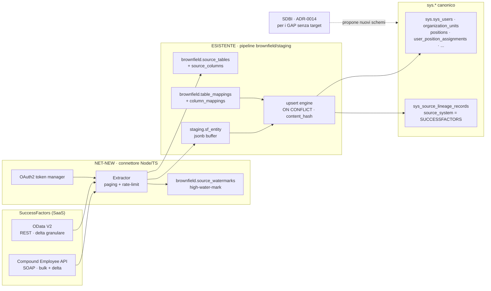
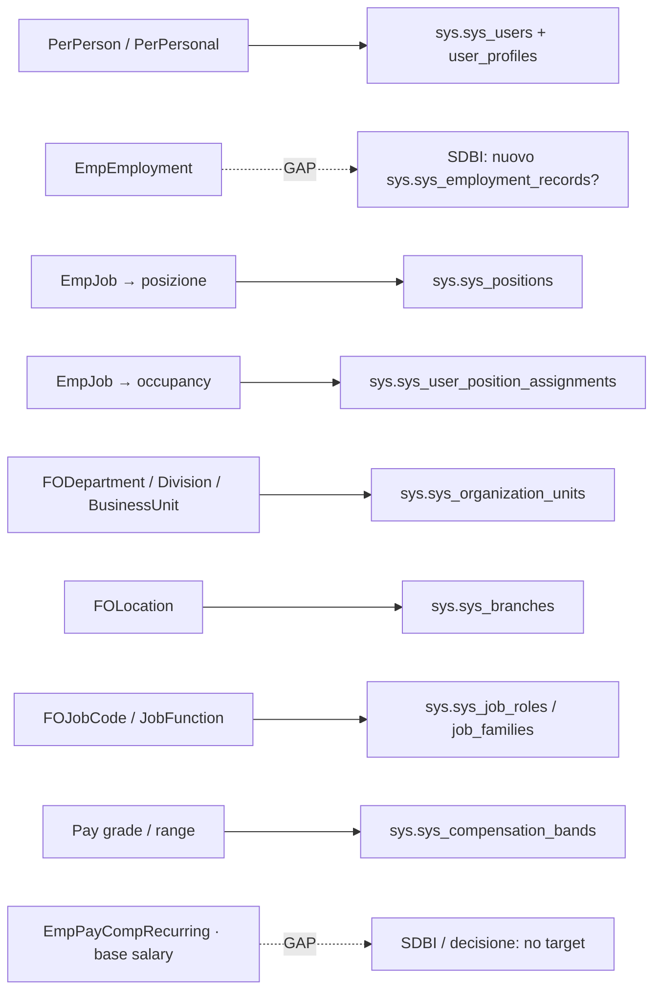
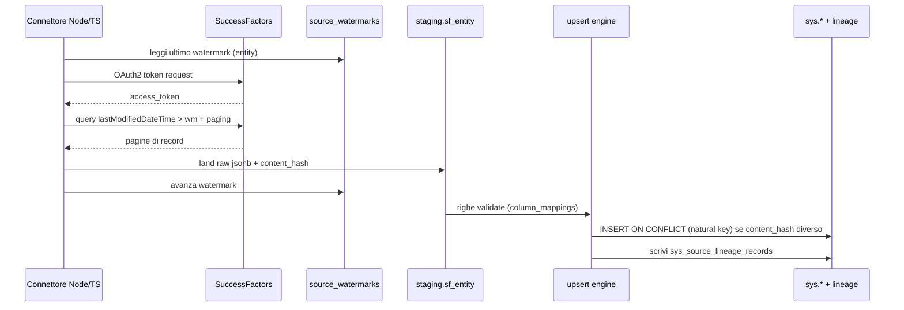

# SuccessFactors → Heuresys — Design di integrazione riconciliato

> [!warning] Stato
> Documento **esplorativo, non approvato**. Il connettore SuccessFactors **non è** un workstream tracciato in `SOT_BACKLOG.md` né in `INTEGRATIONS.md`: è un ramo nuovo. Questo doc riconcilia il design prodotto in sessione web (che non poteva leggere `docs/kb/`) con l'architettura **reale** di ingestion del repo. La SoT di stato resta `docs/kb/*` (CLI-owned). Nessuna migration va applicata e nessuna tabella creata senza numerazione/coordinamento CLI.

## §0 — TL;DR (la decisione)

Il design web proponeva tre schemi nuovi `sf_raw / sf_stg / sf_sync` e un target canonico inventato `core.*`. **Va riformulato**, per due ragioni di fatto verificate sul repo:

1. **Viola l'invariante I3/I4.** Gli schemi ausiliari ammessi sono **esattamente** `staging`, `brownfield`, `audit` (+ `temp_sdbi` per SDBI). Nuovi schemi `sf_*` non sono ammessi (`SOT_STATE §9`).
2. **Reinventa machinery che esiste già.** Decodifica codici (Foundation Objects), column-mapping, upsert delta idempotente, journal dei run, lineage: sono già implementati nel **pipeline brownfield** (`brownfield.*` + `staging.wave1_*` + `sys.sys_source_lineage_records`).

**Decisione riconciliata — pattern β + γ:**

- **β (brownfield-come-nuova-sorgente)** per tutte le entità SF che hanno **già** un target `sys.sys_*`: SF diventa una nuova *source* nel registry brownfield; i payload OData/Compound atterrano nel buffer `staging.sf_<entity>` (stesso pattern jsonb uniforme di `wave1_*`); i `column_mappings` guidano la trasformazione; l'upsert idempotente esistente scrive in `sys.sys_*`; la provenienza è tracciata in `sys_source_lineage_records` con `source_system='SUCCESSFACTORS'`.
- **γ (SDBI, ADR-0014)** per le entità SF **senza target esistente** (rapporto di lavoro EmpEmployment completo, anagrafica PII ricca, base salary contrattuale): è esattamente il caso d'uso SDBI (AI propone nuovo schema `sys.*`, human-checkpoint, `temp_sdbi`).

**L'unico componente davvero net-new è il front-end di estrazione**: un connettore Node/TS che fa OAuth2, pull (Compound Employee bulk + OData delta), gestione rate-limit/paginazione, e **sostituisce lo step `extract-wave1-legacy.sh (pg_dump)`** con `extract-successfactors.ts (API)`. Tutto a valle è il pipeline esistente.

> [!warning] Un flag invariante da confermare (regola §9 "fermarsi e chiedere")
> - **I3/I4 naming.** Il buffer va in `staging.sf_*` (schema `staging` ammesso), **non** in uno schema `sf_*` nuovo (vedi §8.1).
>
> **PII/GDPR — NON è un blocco** (aggiornato 2026-05-31, ADR-0022). La dottrina data-source stabilisce che questo prodotto è un **case-study sintetico** e **non ingerisce mai PII reale di clienti veri**: il no-PII è globale e incondizionato. Anche un eventuale connettore SF opererebbe su dati sintetici → nessun conflitto I12, nessuna governance PII/GDPR richiesta. Il vecchio framing "I12 = blocco perché SF live porta PII reale" è **ritirato** (vedi §8.2).

---

## §1 — Cosa cambia rispetto al design web

| Aspetto | Design web (standalone) | Design riconciliato (questo doc) |
|---|---|---|
| Landing raw | nuovo schema `sf_raw` (jsonb immutabile) | `staging.sf_<entity>` jsonb buffer (pattern `wave1_*`, mig 000030) + `brownfield.source_exports`/`source_tables`/`source_columns` come registry |
| Staging tipizzato | nuovo schema `sf_stg` | buffer jsonb uniforme + `column_mappings` (no mirror tipizzato per-entità: il pattern del repo è volutamente uniforme) |
| Journal / watermark / errori | nuovo schema `sf_sync` | `brownfield.import_runs` (journal) + `audit.import_run_logs` (errori) + **`brownfield.source_watermarks` (NET-NEW)** per il delta high-water-mark |
| Target | `core.*` inventato | `sys.sys_*` reali (users, organization_units, positions, user_position_assignments, job_roles, compensation_bands, …) |
| Decodifica codici (FO) | viste di decode ad-hoc | `column_mappings.transform` + FO come `source_tables` classificate `REFERENCE_ONLY` |
| Idempotenza delta | `ON CONFLICT … WHERE row_hash IS DISTINCT` | meccanismo **già esistente**: `content_hash` + UNIQUE di `sys_source_lineage_records` + ON CONFLICT su natural key |
| Campo sorgente | `api_source` inventato | `sys_source_lineage_records.source_lineage_source_system` (esiste già, default `'OLDDB'` → valore `'SUCCESSFACTORS'`) |

Il design web non era sbagliato in astratto: era **scollegato**. Quasi ogni sua idea ha già un'implementazione nel repo.

---

## §2 — L'architettura di ingestion reale (recap verificato)

Pipeline brownfield deterministico (verified-by: migrations 000024/000025/000030, ADR-0014):

```
extract-wave1-legacy.sh (pg_dump)            ← STEP DA SOSTITUIRE per SF
  → brownfield.source_exports / source_tables / source_columns   (registry)
  → staging.wave1_<target>   (buffer jsonb uniforme: staging_raw_record + provenance + validation)
  → brownfield.table_mappings + column_mappings  (mapping approvato + transform codes)
  → upsert engine (transform-compiler + ON CONFLICT su natural key)
  → sys.sys_<target>
  → sys.sys_source_lineage_records   (1 riga per record canonico; UNIQUE = chiave idempotenza)
  → audit.import_runs / import_run_logs / import_validation_results
```

Tabelle chiave (colonne reali):

- **`brownfield.source_tables`**: `source_table_domain`, `source_table_classification` ∈ {IMPORT, TRANSFORM, REFERENCE_ONLY, EXCLUDE}.
- **`brownfield.column_mappings`**: `column_mapping_transform`, `column_mapping_transform_payload jsonb`, **`column_mapping_pii_disposition`** ∈ {NONE, PSEUDONYMIZE, MASK, DROP, TAG_SYNTHETIC} ← rilevante per GDPR/SF.
- **`staging.wave1_<target>`** (template per `sf_<entity>`): `staging_raw_record jsonb`, `staging_source_record_id`, `staging_source_natural_key`, `staging_source_content_hash`, `staging_validation_status`, `staging_target_record_id`, `staging_upserted_at`.
- **`sys.sys_source_lineage_records`**: `source_lineage_source_system` (default `'OLDDB'`), `source_lineage_source_table`, `source_lineage_source_record_id`, `source_lineage_source_content_hash`, `source_lineage_target_table_name`, `source_lineage_target_record_id`. **UNIQUE(source_system, source_table, source_record_id, target_table_name)** = idempotenza cross-sorgente nativa.

SDBI (ADR-0014, **PROPOSED**): paradigma complementare AI-led per i casi *Tier D — target `sys.*` MANCANTE*. Sei fasi (discovery → analogy matching con human-checkpoint → seeding in `temp_sdbi` → relationship traversal → consolidation review → cleanup). È esattamente lo strumento per i gap SF.

---

## §3 — La decisione: β (brownfield new-source) + γ (SDBI), non sf_*

### §3.1 Mapping concettuale del design web → componenti reali

| "Strato" del design web | Componente reale Heuresys | Net-new? |
|---|---|---|
| `sf_raw` (landing immutabile) | `staging.sf_<entity>.staging_raw_record` + `brownfield.source_exports` | no (pattern esistente) |
| `sf_stg` (mirror tipizzato) | buffer jsonb + `column_mappings` | no |
| `sf_sync.run_journal` | `brownfield.import_runs` | no |
| `sf_sync.error_log` | `audit.import_run_logs` | no |
| `sf_sync.watermark` (delta HWM) | **`brownfield.source_watermarks`** | **SÌ** (il pg_dump è full-snapshot, non ha HWM) |
| `api_source` | `source_lineage_source_system='SUCCESSFACTORS'` | no |
| viste decode FO | `column_mappings.transform` + FO `REFERENCE_ONLY` | no |
| connettore OAuth/extract | `extract-successfactors.ts` | **SÌ** |
| target `core.*` | `sys.sys_*` reali | n/a |

### §3.2 Net-new vs riusato (inventario)

**NET-NEW (5 elementi):**
1. **Connettore Node/TS** `apps/api/src/modules/<…>/successfactors/`: OAuth2 token manager, extractor Compound Employee (SOAP bulk+delta) + OData V2 (REST granular), paginazione (`$top`/`$skip`), rate-limit/backoff.
2. **`brownfield.source_watermarks`**: HWM per (`source_system`, `entity`) → ultimo `lastModifiedDateTime` per il delta incrementale.
3. **`source_system='SUCCESSFACTORS'`** (+ eventuale scope nuovo su `import_runs`: oggi `import_run_wave` ha CHECK 1..4; usare `import_run_classification_scope`/metadata o estendere il CHECK).
4. **Schemi `sys.*` proposti da SDBI** per i gap (es. `sys.sys_employment_records`), human-gated.
5. ~~**Decisione di governance PII/GDPR** che solleva I12 per questa sorgente~~ — **non più net-new**: ADR-0022 (no-PII globale) ha sciolto il punto; nessuna governance PII richiesta per questa sorgente.

**RIUSATO (machinery esistente):** registry `source_exports/tables/columns`, `table_mappings/column_mappings`, buffer `staging.*`, upsert engine + ON CONFLICT, `sys_source_lineage_records` (incl. `content_hash` + `source_system`), audit trail.

---

## §4 — Architettura riconciliata (diagramma)



---

## §5 — Mapping entità SF → `sys.sys_*` reali

> Sostituisce il `core.*` inventato. Target verificati su migrations 000004/000006/000009/000010/000011/000012/000019.

| Entità SuccessFactors | Target reale Heuresys | Note di trasformazione |
|---|---|---|
| **PerPerson / PerPersonal** (anagrafica) | `sys.sys_users` (anchor) + `sys.sys_user_profiles` (1:1) | anagrafica leggera; campi SF-ricchi (DOB, gender, nationality, home address) → `user_metadata`/`user_profile_metadata` jsonb **o** nuove colonne via SDBI (gap §A) |
| **EmpEmployment** (rapporto: hire/term date, reason, seniority, work permit, probation) | **nessun target** | → **SDBI** (proporre `sys.sys_employment_records`) oppure decisione "fuori scope" |
| **EmpJob** (job info time-sliced) | split: `sys.sys_positions` (la posizione, effective-dated) + `sys.sys_user_position_assignments` (l'occupancy: start/end, FTE, kind) | I1 position-centric: incumbent in *assignments*, non in *positions*. UNIQUE: 1 solo PRIMARY ACTIVE per utente |
| **FODepartment / FODivision / FOBusinessUnit** | `sys.sys_organization_units` (effective-dated, self-ref `parent_id`) | discriminare con `organization_unit_type` / `organization_unit_type_id`; gerarchia via `parent_id` (+ closure `sys_organization_hierarchies` derivata) |
| **FOLocation** | `sys.sys_branches` (1:1 con OU, indirizzo/paese/zona) | |
| **FOJobCode / FOJobFunction** | `sys.sys_job_roles` / `sys.sys_job_families` (cataloghi **globali**, no tenant) | mapping ESCO/ISCO via `sys_esco_occupation_mappings` |
| **Pay grade / pay range** | `sys.sys_compensation_bands` (tenant nullable → band globali) | I8: compensation = decision-support, **non** payroll |
| **EmpPayCompRecurring** (base salary contrattuale) | **nessun target** (il modello comp è output calcolato) | → SDBI o decisione "no target"; gap §A.3 |
| **Foundation Objects (codici → label)** | `brownfield.source_tables` classificate `REFERENCE_ONLY` + `column_mappings.transform` | i codici SF si risolvono via mapping, non navigando tabelle a runtime |

### §5.1 Diagramma di lineage (entità → target)



---

## §6 — Delta e idempotenza, mappati ai meccanismi reali

Il design web introduceva `row_hash` e un `ON CONFLICT … WHERE row_hash IS DISTINCT`. Nel repo esiste già tutto l'occorrente:

- **Delta (cosa è cambiato)**: filtro SF su `lastModifiedDateTime > watermark`. Il watermark è l'**unico pezzo persistente net-new** (`brownfield.source_watermarks`), perché il brownfield nasce per pg_dump full-snapshot.
- **Idempotenza (upsert ripetibile)**: `staging_source_content_hash` (= `row_hash`) + `ON CONFLICT` su natural key in `sys.sys_<target>` + UNIQUE di `sys_source_lineage_records(source_system, source_table, source_record_id, target_table_name)`. Riapplicare lo stesso payload non duplica e non sporca la lineage.
- **Provenance multi-sorgente**: `source_lineage_source_system='SUCCESSFACTORS'` separa nativamente i record SF da quelli `OLDDB`/legacy — senza il campo `api_source` inventato.

### §6.1 Sequence di estrazione + upsert



---

## §8 — Conformità invarianti + flag di conflitto

| Invariante | Esito | Nota |
|---|---|---|
| **I1** position-centric | ✅ rispettato | incumbent in `user_position_assignments`, owner ≠ incumbent |
| **I3/I4** schema `sys.sys_*` + aux `staging/brownfield/audit` | ⚠️ **flag** | buffer in `staging.sf_*`, **non** in `sf_*` nuovo (vedi §8.1) |
| **I5** tenant isolation = FK + middleware, mai RLS | ✅ | risoluzione tenant via `brownfield.tenant_id_mappings`, come il brownfield esistente |
| **I12** brownfield/legacy = authoritative no-PII source (ADR-0022) | ✅ | no-PII **globale**: prodotto case-study sintetico, nessun PII reale anche per SF → nessun conflitto (vedi §8.2) |
| **I13** PostgreSQL 16 nativo, no Docker | ✅ | nessun impatto |
| **RD-08/09** varchar+CHECK, date vs timestamptz | ✅ | da rispettare nei mapping (es. `EmpJob.startDate` → `date`) |
| **ADR-0008** PIP = VIEW | ✅ | il PIP non è target d'import; resta vista |

### §8.1 — Flag I3/I4 (naming)
Buffer obbligatoriamente in schema `staging` (es. `staging.sf_per_person`, `staging.sf_emp_job`), generabili con lo stesso DO-block di `000030`. **Nessuno schema `sf_*`.** Decisione: ok adottare il pattern `staging.sf_<entity>`?

### §8.2 — PII/GDPR — NON è un blocco (RITIRATO 2026-05-31, ADR-0022)
Il framing originale trattava I12 come un conflitto perché un import SF *live* di un cliente reale porterebbe PII reale. **Questo blocco è ritirato.** La dottrina data-source (ADR-0022) stabilisce che heuresys-advanced è un **case-study sintetico by design** e **non ingerisce mai PII reale di clienti veri**: il no-PII è **globale e incondizionato** (verificato: tutte le `column_mappings` hanno `pii_disposition=NONE`). Un eventuale connettore SF opererebbe quindi su dati sintetici/dimostrativi, senza alcuna governance PII/GDPR né `column_mapping_pii_disposition` non-NONE. Se in futuro lo scopo del prodotto cambiasse (ingestion di PII reale di un cliente vero), **quello** richiederebbe un nuovo ADR di governance PII dedicato — ma non è il caso attuale e non è silenziosamente derogabile (vedi ADR-0022 §4).

---

## §9 — DDL delta proposto (solo net-new) — **PROPOSED / DO-NOT-APPLY**

> Illustrativo. Le migration reali ricevono numero sequenziale e vanno applicate **solo** via coordinamento CLI (disciplina migration: idempotenti, `IF NOT EXISTS`, twice-run pulito).

```sql
-- NET-NEW 1: watermark per delta incrementale (l'unico pezzo che il brownfield non ha)
CREATE TABLE IF NOT EXISTS brownfield.source_watermarks (
  source_watermark_id        uuid PRIMARY KEY DEFAULT gen_random_uuid(),
  source_watermark_system    varchar(64)  NOT NULL,          -- 'SUCCESSFACTORS'
  source_watermark_entity    varchar(128) NOT NULL,          -- 'PerPerson' | 'EmpJob' | ...
  source_watermark_tenant_id uuid REFERENCES sys.sys_tenancies(tenant_id) ON DELETE CASCADE,
  source_watermark_value     timestamptz NOT NULL,           -- ultimo lastModifiedDateTime estratto
  source_watermark_metadata  jsonb NOT NULL DEFAULT '{}'::jsonb,
  created_at  timestamptz NOT NULL DEFAULT now(),
  updated_at  timestamptz NOT NULL DEFAULT now()
);
CREATE UNIQUE INDEX IF NOT EXISTS brownfield_source_watermarks_uq
  ON brownfield.source_watermarks (source_watermark_system, source_watermark_entity,
                                   COALESCE(source_watermark_tenant_id, '00000000-0000-0000-0000-000000000000'));

-- NET-NEW 2: buffer staging per le entità SF (stesso pattern jsonb uniforme di 000030)
--   staging.sf_per_person, staging.sf_emp_job, staging.sf_fo_department, ...
--   generabili con il DO-block FOREACH di 000030 (colonne identiche a staging.wave1_*).

-- NET-NEW 3 (opzionale): estendere il CHECK di import_runs se serve un wave/scopo dedicato
--   oggi: import_run_wave BETWEEN 1 AND 4. Alternativa: usare import_run_classification_scope.
```

I nuovi schemi `sys.*` per i gap (es. `sys.sys_employment_records`) **non** sono qui: passano da SDBI (ADR-0014, Phase 2 human-gated).

---

## §10 — Decisioni aperte per Enzo

1. ~~**PII/GDPR (I12)** — bloccante~~ → **RISOLTO (ADR-0022)**: no-PII globale, il prodotto non ingerisce PII reale → nessun blocco, nessuna governance PII da definire (§8.2).
2. **Gap senza target** — EmpEmployment, anagrafica ricca, base salary: SDBI (nuovi schemi) o "fuori scope MVP"? (§A)
3. **Scope entità** — quali entità EC servono davvero in Heuresys nel MVP del connettore? (dimensiona tutto il resto)
4. **Naming staging** — confermare `staging.sf_<entity>` (§8.1).
5. **Tracciamento** — adottare questo design nel repo (via CLI) e aprire un item in `SOT_BACKLOG.md`? (proposta già in `COWORK_INBOX.md`)

Passo successivo naturale (se 1–4 sono decisi): scaffold del connettore Node/TS (token manager OAuth + extractor Compound/OData + writer verso `staging.sf_*`), che è l'**unico** componente net-new di codice.

---

## §A — Appendice: gap SF senza target `sys.*` (verificati)

1. **Anagrafica SF-ricca** (date_of_birth, gender, nationality, national ID, home address, marital status): nessuna colonna dedicata → `*_metadata` jsonb o nuove colonne via SDBI.
2. **EmpEmployment** (rapporto di lavoro: hire/termination date+reason, original start, seniority, work permit, probation): **nessun target diretto**. `user_position_assignments` copre l'occupancy, non la semantica employment.
3. **Base compensation contrattuale** (EmpPayCompRecurring base salary): nessun store di salary corrente; il modello comp Heuresys è decision-support/output (I8), non contrattuale.
4. **Contatti secondari / emergency**: solo `user_profile_phone` + jsonb.

*Fine documento.*
