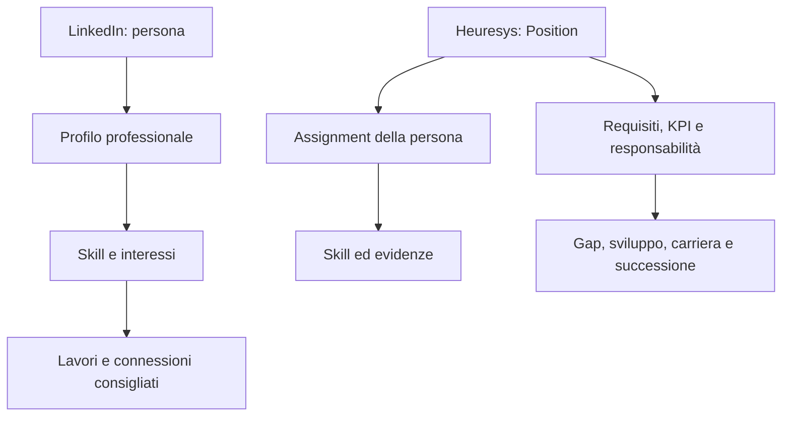
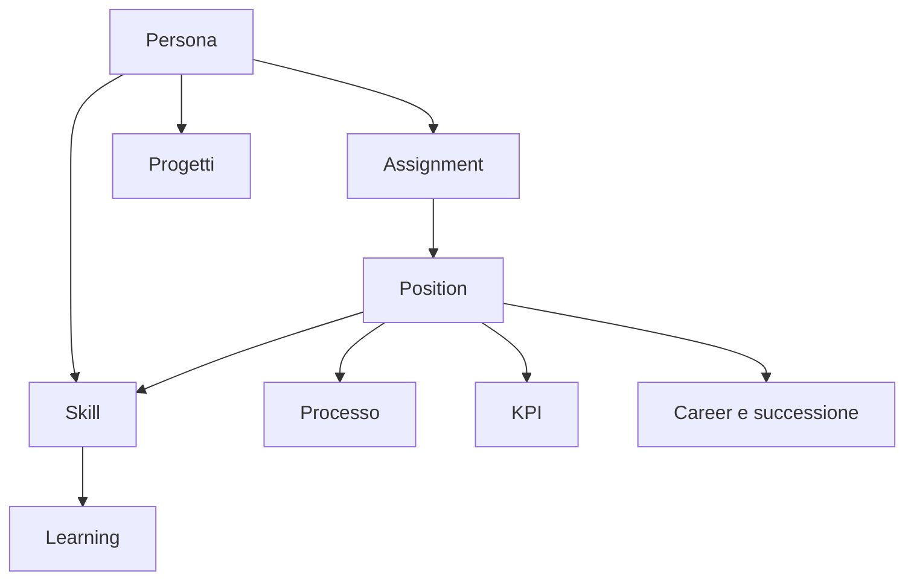

LinkedIn può essere un riferimento molto importante per Heuresys, ma occorre usarlo correttamente:

> **LinkedIn è un eccellente modello di esperienza, scoperta e raccomandazione; non è un buon modello per la struttura anagrafica e decisionale di un HRMS.**

LinkedIn è costruito intorno alla persona e alla sua rappresentazione pubblica. Heuresys, invece, deve restare costruito intorno alla **Position**, all’organizzazione, ai processi e alle evidenze verificabili.

## 1. Il modello LinkedIn e quello Heuresys

| LinkedIn                          | Heuresys                                                                 |
| --------------------------------- | ------------------------------------------------------------------------ |
| Profilo professionale individuale | Persona collegata a una o più Position tramite assignment                |
| Esperienze dichiarate dall’utente | Storico verificato delle assegnazioni                                    |
| Skill dichiarate o suggerite      | Skill dichiarate, inferite, valutate e certificate                       |
| Endorsement dei contatti          | Evidenze contestuali prodotte da manager, assessor, progetti e risultati |
| Azienda come pagina pubblica      | Tenant, legal entity, unità organizzative e sedi                         |
| Job posting                       | Vacancy associata a una Position approvata                               |
| Suggerimenti di lavoro            | Mobilità interna, career path e successione                              |
| Recruiter search                  | Ricerca persone interne ed esterne rispetto a requisiti governati        |
| LinkedIn Learning                 | Catalogo formativo collegato ai gap di Position                          |
| Economic Graph                    | Workforce Intelligence aziendale e benchmark esterni                     |
| Social network                    | Knowledge e collaboration graph interno                                  |

La differenza fondamentale è questa:



## 2. Il profilo LinkedIn è il principale riferimento di esperienza

LinkedIn organizza il profilo in esperienze, formazione, competenze, certificazioni, progetti, pubblicazioni, lingue, raccomandazioni e risultati. Consente inoltre di collegare le skill a esperienze, progetti e credenziali. [LinkedIn Profile Sections](https://www.linkedin.com/help/linkedin/answer/a540837/add-sections-to-your-profile)

Heuresys dovrebbe adottare la stessa immediatezza, creando un **Professional Profile** facilmente comprensibile al dipendente.

Dovrebbe contenere:

- Position attuale e assignment;

- precedenti Position interne ed esperienze esterne;

- responsabilità e processi presidiati;

- skill;

- certificazioni;

- formazione;

- progetti;

- KPI e risultati professionali;

- aspirazioni e preferenze di carriera;

- disponibilità alla mobilità;

- lingue;

- portfolio ed evidenze;

- feedback ricevuti.

Ma ogni informazione dovrebbe avere una provenienza esplicita.

| Stato dell’informazione | Esempio                                             |
| ----------------------- | --------------------------------------------------- |
| dichiarata              | il dipendente aggiunge una skill                    |
| importata               | titolo ricavato da HRIS o CV                        |
| inferita                | skill suggerita sulla base di esperienze e progetti |
| confermata              | manager o responsabile di progetto la riconosce     |
| valutata                | assessment con livello e metodo                     |
| certificata             | attestato verificato                                |
| osservata               | evidenza prodotta durante un progetto               |
| scaduta                 | certificazione o valutazione non più valida         |

Questa distinzione sarebbe molto più rigorosa del profilo LinkedIn.

## 3. Le skill: LinkedIn è il riferimento, ma anche l’anti-riferimento

LinkedIn consente fino a 100 skill, le organizza in aree di conoscenza, tecnologie e competenze interpersonali e permette ai collegamenti di confermarle tramite endorsement. [LinkedIn Skills](https://www.linkedin.com/help/linkedin/answer/a568137) Gli assessment automatici di LinkedIn, invece, non sono più disponibili: LinkedIn invita ora a collegare le competenze a lavori, progetti, studi e credenziali. [LinkedIn Skill Assessments](https://www.linkedin.com/help/linkedin/answer/a507663)

Questo cambiamento è molto significativo per Heuresys:

> Una skill non dovrebbe essere dimostrata da un semplice test o da molti “like”, ma da evidenze professionali contestualizzate.

Per ogni relazione persona–skill, Heuresys dovrebbe quindi registrare:

- livello;

- metodo di acquisizione;

- metodo di valutazione;

- evidenza;

- contesto organizzativo;

- Position o progetto in cui è stata esercitata;

- soggetto validatore;

- data della valutazione;

- grado di affidabilità;

- eventuale scadenza;

- origine del dato.

L’endorsement LinkedIn può essere ripreso solo come **segnale debole**, non come valutazione.

Per esempio:

> “Confermo di aver osservato questa competenza durante il progetto X, nel ruolo Y, nel periodo Z.”

Questo è molto diverso dal semplice “Mario ha confermato la skill Leadership”.

## 4. LinkedIn Career Hub è probabilmente il riferimento più vicino

Il prodotto LinkedIn Learning Career Hub comprende:

- Talent Architecture;

- Next Role Explorer;

- Role Guides;

- Career Goals;

- piani di sviluppo generati dall’AI;

- opportunità interne;

- segnalazione dell’interesse verso una posizione;

- integrazione con HRIS;

- insight sulle skill emergenti;

- collegamento tra apprendimento e mobilità interna. [LinkedIn Learning Career Hub](https://business.linkedin.com/learn/product-overview)

Questa è la parte di LinkedIn più direttamente rilevante per Heuresys.

### Corrispondenze funzionali

| LinkedIn Career Hub           | Funzione Heuresys                     |
| ----------------------------- | ------------------------------------- |
| Talent Architecture           | Position Catalogue e Job Architecture |
| Next Role Explorer            | Career Path Explorer                  |
| Role Guides                   | Position Profile e Job Profile        |
| Career Goals                  | Aspirazioni e obiettivi di carriera   |
| AI Learning Plan              | Position-Based Learning Plan          |
| Jobs at Your Company          | Internal Opportunity Marketplace      |
| Interested Internal Candidate | Manifestazione riservata d’interesse  |
| Trending Skills               | Workforce Intelligence                |
| Internal Projects             | Gig e Project Marketplace             |
| Career Insights               | Talent mobility analytics             |

### Come migliorarlo in Heuresys

LinkedIn parte prevalentemente dal titolo professionale e dal profilo della persona. Heuresys dovrebbe partire dalla struttura formale:

```text
Position attuale
→ skill possedute
→ skill richieste dalla Position obiettivo
→ gap verificato
→ learning ed esperienze necessarie
→ livello di readiness
→ opportunità disponibili
→ eventuale candidatura o piano di successione
```

La raccomandazione dovrebbe spiegare:

- perché una Position è compatibile;

- quali skill coincidono;

- quali skill sono adiacenti;

- quali gap esistono;

- quali esperienze possono colmarli;

- quanto tempo potrebbe richiedere il percorso;

- quali vincoli organizzativi o contrattuali esistono.

## 5. LinkedIn Recruiter come riferimento per Talent Acquisition

LinkedIn Recruiter offre ricerca assistita dall’AI, oltre 40 filtri, progetti di recruiting, messaggistica personalizzata, collaborazione, analytics e integrazioni ATS. [LinkedIn Recruiter](https://business.linkedin.com/hire/recruiter)

La ricerca può essere avviata in linguaggio naturale, partendo da:

- descrizione del candidato ideale;

- job description;

- link alla vacancy;

- note dell’intake meeting;

- competenze critiche;

- localizzazione e vincoli.

LinkedIn traduce la richiesta in filtri e suggerimenti. [AI-Assisted Search](https://www.linkedin.com/help/recruiter/answer/a6509735)

Heuresys potrebbe adottare lo stesso principio:

> “Cerco una persona interna per coordinare il processo di credito, con esperienza di filiale, competenze di risk management e disponibilità a Milano entro sei mesi.”

Il sistema dovrebbe:

1. identificare le Position coerenti;

2. tradurre la richiesta in requisiti strutturati;

3. cercare persone assegnate o disponibili;

4. considerare skill adiacenti;

5. spiegare i match;

6. proporre candidati “ready now”, “ready soon” e “development candidate”;

7. salvare il risultato in un Talent Project.

### Talent Project

Il concetto di “Project” di LinkedIn Recruiter può diventare in Heuresys un contenitore per:

- vacancy;

- successione;

- nuova unità organizzativa;

- progetto temporaneo;

- redeployment;

- talent pool;

- piano di sviluppo collettivo.

All’interno si possono conservare:

- requisiti;

- persone considerate;

- motivazioni dei match;

- shortlist;

- decisioni;

- attività;

- comunicazioni;

- audit trail.

## 6. Gli agenti LinkedIn come modello di human-in-the-loop

Nel 2026 LinkedIn sta estendendo Hiring Assistant con intake, sourcing, valutazione delle candidature, shortlist e contatto. Il recruiter può interrompere, correggere o indirizzare l’agente e ricevere spiegazioni quando un feedback non viene applicato. [LinkedIn Hiring Assistant](https://business.linkedin.com/hire/hiring-assistant) · [LinkedIn Hiring Release 2026](https://business.linkedin.com/hire/product-update/hire-release)

Per Heuresys il riferimento corretto non è “un chatbot HR”, ma un agente con:

- obiettivo esplicito;

- perimetro autorizzato;

- criteri strutturati;

- fonti dichiarate;

- azioni consentite;

- checkpoint umani;

- motivazioni;

- log completo;

- possibilità di annullamento.

Esempi:

- Talent Acquisition Agent;

- Career Coach;

- Succession Planning Agent;

- Workforce Planning Agent;

- Learning Path Agent;

- Position Design Agent;

- Skill Taxonomy Agent;

- Organizational Design Agent.

L’agente dovrebbe poter **preparare e proporre**, ma non assumere, promuovere, valutare o licenziare autonomamente.

## 7. Talent Insights come riferimento per Workforce Intelligence

LinkedIn Talent Insights osserva:

- disponibilità di talenti;

- distribuzione geografica;

- skill;

- seniority;

- aziende di provenienza;

- crescita e riduzione delle workforce;

- flussi di talento;

- confronto con concorrenti;

- trend del mercato del lavoro. [LinkedIn Talent Insights](https://business.linkedin.com/hire/talent-insights)

Il suo fondamento è l’Economic Graph, che LinkedIn descrive nel 2026 come un grafo composto da circa 1,3 miliardi di membri, 71 milioni di aziende, 145.000 scuole e 42.000 skill. [LinkedIn Economic Graph](https://economicgraph.linkedin.com/)

Heuresys non può replicare questa scala, ma può costruire un **Enterprise Talent Graph** molto più profondo:



A questo grafo interno può essere aggiunto un livello esterno basato su:

- ESCO;

- O*NET;

- ATECO/NACE;

- dati Excelsior–Unioncamere;

- ISTAT;

- EURES;

- repertori regionali;

- CCNL;

- fonti formative istituzionali;

- dati del mercato del lavoro autorizzati.

In questo modo Heuresys avrebbe un vantaggio distintivo europeo e italiano.

## 8. Il “social graph” può diventare un knowledge graph interno

LinkedIn utilizza connessioni, interazioni e raccomandazioni per capire relazioni e rilevanza professionale.

Heuresys non dovrebbe creare una copia del social network, ma può modellare relazioni professionali utili:

- ha lavorato con;

- ha riportato a;

- ha valutato;

- ha fatto da mentor;

- ha partecipato allo stesso progetto;

- possiede conoscenze complementari;

- è subject matter expert;

- può trasferire una conoscenza;

- può sostituire temporaneamente;

- fa parte di una community professionale.

Questo consentirebbe funzioni come:

- “chi conosce questo processo?”;

- “chi può fare mentoring?”;

- “dove esiste il rischio di perdita di conoscenza?”;

- “quali persone collegano unità organizzative separate?”;

- “chi ha già affrontato un progetto simile?”.

Tali relazioni non devono diventare un punteggio nascosto di popolarità.

## 9. Funzionalità LinkedIn da non copiare direttamente

| Meccanismo LinkedIn                 | Problema in Heuresys            | Soluzione                                       |
| ----------------------------------- | ------------------------------- | ----------------------------------------------- |
| skill endorsement libero            | scarsa attendibilità            | evidenza contestuale e livello di affidabilità  |
| conteggio delle connessioni         | incentiva popolarità            | relazioni professionali tipizzate               |
| “chi ha visto il profilo”           | rischio di sorveglianza interna | analytics aggregati e finalità esplicita        |
| feed sociale generalista            | rumore e problemi moderativi    | knowledge feed collegato a processi e community |
| profilo interamente auto-dichiarato | conflitto con dati HR ufficiali | separazione tra dato ufficiale e dichiarato     |
| ranking opaco                       | rischio discriminazione         | spiegazione, audit e revisione umana            |
| titolo professionale come chiave    | titoli ambigui                  | Position e job architecture governate           |
| completion dei corsi come skill     | inferenza debole                | learning completion separato dalla mastery      |
| pubblicità e engagement             | non coerenti con HRMS           | valore professionale, non tempo trascorso       |
| importazione massiva dei profili    | problemi legali e contrattuali  | API autorizzate e consenso individuale          |

È inoltre importante non progettare Heuresys presupponendo lo scraping di LinkedIn: le condizioni LinkedIn vietano l’estrazione automatizzata senza autorizzazione e limitano fortemente l’uso dei contenuti fuori dalle API ufficiali. [LinkedIn Crawling Terms](https://www.linkedin.com/legal/crawling-terms) · [LinkedIn API Terms](https://www.linkedin.com/legal/l/api-terms-of-use)

## 10. La sintesi architetturale

LinkedIn può essere riferimento per quattro superfici:

| Superficie            | Cosa apprendere                             |
| --------------------- | ------------------------------------------- |
| Professional Identity | profilo ricco, comprensibile e aggiornabile |
| Opportunity Discovery | ricerca semantica e raccomandazioni         |
| Career Experience     | ruoli futuri, gap e piani personalizzati    |
| Talent Intelligence   | trend, benchmark e scenari                  |

Ma il nucleo Heuresys deve rimanere diverso:

> **LinkedIn organizza opportunità intorno alla persona. Heuresys deve organizzare persone, lavoro e sviluppo intorno alla Position e ai processi aziendali.**

La proposta funzionale più coerente sarebbe pertanto costruire in Heuresys sei esperienze collegate:

1. **Professional Profile**

2. **Position & Role Guide**

3. **Career Explorer**

4. **Internal Opportunity Marketplace**

5. **Talent Search & Projects**

6. **Workforce Intelligence**

Queste sei esperienze utilizzerebbero lo stesso modello sottostante di Position, assignment, skills, processi, KPI, learning, assessment e successione. LinkedIn fornirebbe il riferimento di usabilità e scoperta; Heuresys aggiungerebbe struttura, affidabilità, governance e contestualizzazione organizzativa.
