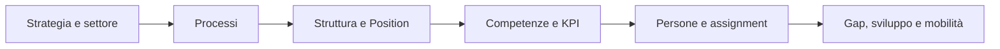
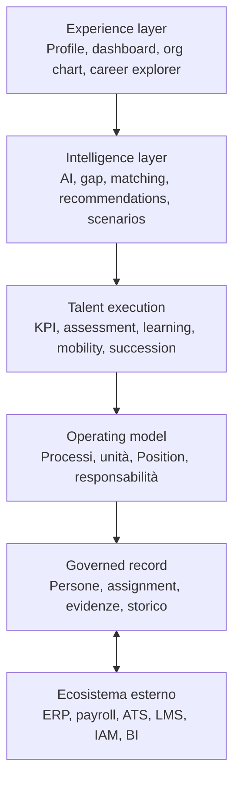

La mia raccomandazione netta è di non presentare Heuresys come un semplice **HRMS**, né come una generica piattaforma di **Talent Management**. Entrambe le definizioni descrivono soltanto una parte del prodotto.

La categoria più corretta e differenziante è:

> **Heuresys è una piattaforma di Organizational Intelligence & Workforce Orchestration, position-centric e AI-augmented.**

In italiano:

> **Heuresys è una piattaforma di intelligenza organizzativa e orchestrazione della forza lavoro che collega strategia, processi, struttura, posizioni, competenze, obiettivi e sviluppo delle persone in un unico modello governato.**

## 1. Il posizionamento centrale

La proposta di valore non è “gestire meglio i dipendenti”, ma:

> **Trasformare il modello operativo dell’impresa in una struttura organizzativa eseguibile, misurabile e sviluppabile.**

Il percorso logico distintivo di Heuresys è:

Questa continuità è più importante delle singole funzionalità. Molti concorrenti dispongono di skill matching, organigrammi, performance management o succession planning; pochi costruiscono una relazione governata fra:

- motivo per cui il lavoro esiste;

- processo nel quale il lavoro è svolto;

- posizione responsabile;

- competenze richieste;

- persona assegnata;

- risultati attesi;

- evidenze disponibili;

- azioni di sviluppo conseguenti.

## 2. La categoria di prodotto

Suggerirei una classificazione su tre livelli.

| Livello                    | Definizione raccomandata                                           | Utilizzo                                        |
| -------------------------- | ------------------------------------------------------------------ | ----------------------------------------------- |
| Categoria primaria         | **Organizational Intelligence & Workforce Orchestration Platform** | Sito, presentazioni, investitori, partnership   |
| Descrizione architetturale | **Position-centric HRMS + BPM Platform**                           | Documentazione tecnica e comparazioni           |
| Categoria funzionale       | **Organization, Talent and Skills Intelligence**                   | Marketplace, analisti, gare e ricerche software |

“HRMS” deve rimanere nella descrizione, ma non essere l’etichetta principale. Da solo suggerirebbe la presenza di payroll, presenze, welfare e amministrazione del personale, che non sono il centro di Heuresys e sono fuori dall’ambito stabilito.

Anche “Workforce Management” andrebbe usato con cautela: sul mercato viene frequentemente associato a turnistica, presenze e scheduling.

## 3. La definizione breve del prodotto

### Versione istituzionale

> Heuresys è una piattaforma SaaS multi-tenant di Organizational Intelligence e Workforce Orchestration. Attraverso un modello position-centric e un enterprise knowledge graph, connette processi, unità organizzative, posizioni, persone, competenze, KPI, assessment, learning, carriera e successione. L’AI supporta la progettazione e le decisioni organizzative attraverso raccomandazioni verificabili, configurabili e governate.

### Versione commerciale

> Heuresys aiuta le imprese a progettare l’organizzazione, definire ciò che ogni posizione deve realizzare, misurare i gap della forza lavoro e trasformarli in azioni di sviluppo, mobilità e successione.

### Tagline consigliata

> **Design the organization. Develop the workforce. Execute the strategy.**

Alternativa più sintetica:

> **From business design to workforce execution.**

## 4. Il vero elemento distintivo: la Position

L’oggetto centrale di Heuresys non è il dipendente, il profilo professionale o il job title, ma la **Position**.

Questa scelta permette di distinguere correttamente:

- la posizione prevista dall’organizzazione;

- il job o modello professionale associato;

- il ruolo svolto nel processo;

- la persona assegnata;

- la tipologia di assignment;

- la posizione vacante;

- gli incarichi temporanei o secondari;

- lo storico degli assegnatari;

- le competenze e i KPI richiesti dalla posizione.

È una differenza sostanziale rispetto alle piattaforme people-centric. Una persona cambia nel tempo; la posizione appartiene al disegno organizzativo e può esistere anche senza un incumbent.

La promessa di prodotto potrebbe quindi essere:

> **Heuresys non descrive soltanto le persone presenti nell’impresa: rappresenta il lavoro che l’impresa deve svolgere e collega le persone a quel lavoro.**

## 5. Le caratteristiche uniche da dichiarare

### 5.1 Enterprise Blueprint Generator

Heuresys può partire dalla tipizzazione dell’impresa:

- settore ATECO/NACE;

- dimensione aziendale;

- modello operativo;

- articolazione territoriale;

- vincoli organizzativi;

- configurazione contrattuale e normativa.

Da questi input genera o propone un blueprint coerente comprendente:

- processi;

- struttura organizzativa;

- posizioni;

- job e responsabilità;

- competenze;

- KPI;

- controlli;

- percorsi di sviluppo.

Non dovrebbe essere presentato come un semplice catalogo di template, ma come un **motore di configurazione organizzativa assistito dall’AI**.

### 5.2 Convergenza fra HRMS e BPM

Heuresys collega l’organizzazione delle persone all’organizzazione del lavoro.

Un normale HRMS risponde prevalentemente a “chi lavora qui?”.  
Un BPM risponde a “come funziona questo processo?”.  
Heuresys deve rispondere a entrambe le domande e aggiungere:

- quale posizione è accountable;

- quali competenze sono necessarie;

- quali KPI misurano il risultato;

- chi occupa la posizione;

- quale gap esiste;

- quale intervento è richiesto.

### 5.3 Enterprise e workforce knowledge graph

Il modello sottostante può essere descritto come un grafo organizzativo governato:

> Organization → Process → Organizational Unit → Position → Assignment → Person → Skill → KPI → Assessment → Learning → Career → Succession.

Questo consente navigazione bidirezionale:

- dalla strategia alla singola persona;

- dalla persona ai processi sui quali può produrre valore;

- dalla competenza ai ruoli che la richiedono;

- dal KPI alle posizioni che contribuiscono al risultato.

### 5.4 Skills intelligence basata su evidenze

Heuresys non dovrebbe limitarsi a dichiarare che “usa l’AI per inferire le skill”. La caratteristica distintiva è la governance dell’informazione:

- skill richiesta dalla posizione;

- skill dichiarata dalla persona;

- skill inferita;

- skill osservata;

- skill valutata;

- skill validata;

- livello di padronanza;

- fonte ed evidenza;

- data e validità;

- soggetto che ha approvato la valutazione.

Un principio importante è:

> **Il completamento di un corso non equivale automaticamente alla padronanza di una competenza.**

Questa separazione rende più affidabili gap analysis, mobilità, successione e raccomandazioni formative.

### 5.5 Position-based development

Learning, carriera e successione non sono moduli isolati. Sono conseguenze del confronto fra:

- requisiti della posizione attuale;

- evidenze della persona;

- requisiti della posizione target;

- gap da colmare;

- esperienze e formazione disponibili.

In questo modo Heuresys può spiegare non solo **cosa** raccomanda, ma anche **perché**.

### 5.6 KPI collegati all’operating model

I KPI non nascono esclusivamente nella scheda di valutazione individuale. Possono discendere da:

- obiettivi aziendali;

- processi;

- unità organizzative;

- responsabilità della posizione;

- contributo della persona assegnata.

Questo permette di collegare performance, assessment e compensation intelligence senza trasformare Heuresys in un sistema paghe.

### 5.7 Configurazione settoriale

La piattaforma dispone di un’architettura HR stabile, ma abilita modelli specifici per settore e tenant:

- processi caratteristici;

- strutture organizzative;

- posizioni;

- competenze;

- KPI;

- controlli;

- obblighi e riferimenti contrattuali.

La reference implementation FIN_BANKING può dimostrare la profondità verticale, mentre il framework generale rimane riutilizzabile negli altri settori.

### 5.8 Fondazione europea e italiana

Un differenziatore importante rispetto ai vendor globali è l’utilizzo strutturato di:

- ATECO e NACE;

- ESCO;

- CCNL;

- fonti istituzionali;

- cataloghi formativi verificabili;

- tassonomie e classificazioni versionate.

Questo rende Heuresys particolarmente credibile per le imprese europee e italiane, soprattutto nel segmento PMI strutturate.

### 5.9 AI governata e verificabile

L’AI deve essere presentata come capacità operativa, non come slogan.

Heuresys può dichiarare che l’AI:

- genera proposte organizzative;

- completa e normalizza dati;

- suggerisce relazioni;

- individua gap;

- propone candidati, percorsi e successori;

- spiega le raccomandazioni;

- mantiene provenienza e livello di confidenza;

- opera entro policy e autorizzazioni;

- sottopone le decisioni sensibili ad approvazione umana.

La formula appropriata è:

> **AI-assisted decisions, human-governed outcomes.**

## 6. I pillar funzionali

Suggerirei di organizzare l’offerta commerciale in questi prodotti o pillar.

| Pillar                                 | Funzionalità principali                                                                                                    |
| -------------------------------------- | -------------------------------------------------------------------------------------------------------------------------- |
| **Enterprise Blueprint**               | Tipizzazione dell’impresa, blueprint settoriali, generazione assistita di processi, struttura, posizioni, competenze e KPI |
| **Organization & Position Management** | Organigramma, unità, posizioni, job, vacancy, reporting line, assignment multipli e storico                                |
| **Process & Accountability**           | Process map, responsabilità, owner, controlli, collegamento processi–posizioni                                             |
| **Skills & Capability Intelligence**   | Tassonomie, proficiency, evidenze, assessment, gap analysis, skill inference governata                                     |
| **Performance & KPI**                  | KPI library, cascading, target, contributi, assessment e collegamento ai processi                                          |
| **Learning & Development**             | Percorsi position-based, formazione raccomandata, evidenze e verifica dell’efficacia                                       |
| **Career & Internal Mobility**         | Career path, opportunità interne, readiness, confronto con posizioni target                                                |
| **Succession Management**              | Posizioni critiche, successor pool, readiness, rischio e piani di sviluppo                                                 |
| **Workforce Intelligence & Planning**  | Capacità disponibile, gap futuri, scenari, fabbisogni e rischio organizzativo                                              |
| **Compensation Intelligence**          | Benchmark, coerenza retributiva e input per sistemi premianti, esclusa l’esecuzione payroll                                |
| **Organizational Experience**          | Profili, organigrammi, process map, career explorer, dashboard e viste decisionali                                         |

## 7. La collocazione nello stack applicativo

Heuresys si colloca quindi fra i sistemi transazionali e i sistemi decisionali:

| Stack aziendale             | Ruolo di Heuresys                                                             |
| --------------------------- | ----------------------------------------------------------------------------- |
| ERP e amministrazione       | Riceve o scambia dati, senza sostituire necessariamente l’ERP                 |
| Payroll, presenze e benefit | Sistemi esterni autorevoli                                                    |
| Core HR                     | Gestisce il modello organizzativo, Position, assignment, profili ed evidenze  |
| BPM                         | Modella processi, responsabilità e relazione con l’organizzazione             |
| Talent Management           | Coordina skill, performance, learning, carriera e successione                 |
| Talent Intelligence         | Produce gap, matching, raccomandazioni e scenari                              |
| BI e analytics              | Fornisce dati governati e viste specialistiche; può integrarsi con BI esterna |
| Employee experience         | Offre esperienze professionali e percorsi interni personalizzati              |

In termini architetturali, Heuresys può essere presentato come il **governance and intelligence layer tra ERP, HR e BI**.

## 8. Come si colloca rispetto alle famiglie di competitor

| Famiglia                        | Esempi di mercato                       | Relazione con Heuresys                                                                                         |
| ------------------------------- | --------------------------------------- | -------------------------------------------------------------------------------------------------------------- |
| Suite HCM                       | SAP SuccessFactors, Workday, Oracle HCM | Heuresys non deve inseguire l’ampiezza amministrativa; compete sulla profondità organizzativa e può integrarsi |
| Talent intelligence             | Eightfold, Beamery                      | Compete su skill, matching, mobilità e successione, differenziandosi per processi e Position                   |
| Talent marketplace              | Gloat, Fuel50                           | Compete sull’esperienza di mobilità, ma con requisiti organizzativi più governati                              |
| Professional network            | LinkedIn                                | Riferimento UX per identità, discovery e raccomandazioni; non sistema organizzativo autorevole                 |
| Org design e workforce planning | Orgvue, ChartHop                        | Compete sulla struttura, aggiungendo processi, skill, KPI e sviluppo                                           |
| People analytics                | Visier                                  | Complementare o competitivo nell’intelligence, ma Heuresys è anche operativo                                   |
| BPM e process intelligence      | ARIS, Signavio                          | Compete sul collegamento processo–organizzazione, senza voler essere un BPM tecnico generalista                |
| LMS/LXP                         | Cornerstone, Degreed                    | Heuresys orchestra lo sviluppo position-based e può integrare contenuti e learning execution esterni           |

## 9. Il ruolo di LinkedIn

LinkedIn può essere un riferimento per la **superficie esperienziale** di Heuresys:

- profilo professionale;

- rappresentazione delle competenze;

- ricerca e discovery;

- raccomandazioni;

- opportunità;

- percorsi di carriera;

- network e relazioni professionali.

Non deve invece diventare il riferimento per il modello informativo. LinkedIn è centrato sull’identità professionale dichiarata dall’individuo; Heuresys è centrato sul modello operativo governato dall’organizzazione.

La distinzione è:

> **LinkedIn rappresenta come una persona si presenta nel mercato del lavoro; Heuresys rappresenta come competenze, persone e posizioni producono valore all’interno dell’impresa.**

## 10. Cosa Heuresys non dovrebbe dichiarare di essere

Per preservare la chiarezza del posizionamento, eviterei queste definizioni:

- “suite HCM completa”;

- “software per la gestione del personale”;

- “piattaforma di workforce management” senza qualificazioni;

- “social network aziendale”;

- “LMS intelligente”;

- “ATS basato sull’AI”;

- “people analytics dashboard”;

- “digital twin dell’organizzazione”, salvo possedere realmente capacità di simulazione mature.

I confini dovrebbero essere espliciti:

- payroll execution: escluso;

- time and attendance: escluso;

- benefit e welfare administration: esclusi;

- dati medici o anamnestici: esclusi;

- formazione: orchestrata e misurata, ma i contenuti possono provenire da LMS e provider esterni;

- recruiting: eventualmente supportato dalla Position e dalle skill, ma non necessariamente ATS transazionale completo.

## 11. La formula competitiva più forte

Il vantaggio di Heuresys non è una singola funzione “unica”. Quasi ogni funzione isolata è già disponibile sul mercato.

L’unicità difendibile risiede nella combinazione:

> **Position-centric model + BPM + skills evidence + KPI cascade + development + career and succession + sector blueprints + governed AI.**

La formulazione finale che utilizzerei è:

> **Heuresys è la piattaforma position-centric che trasforma il modello operativo dell’impresa in una workforce intelligence azionabile. Collega processi, struttura, posizioni, persone, competenze e risultati, permettendo di progettare l’organizzazione, individuare i gap e orchestrare sviluppo, mobilità e successione attraverso un’AI trasparente e governata.**

Per la comunicazione commerciale sarà importante separare sempre tre livelli: **disponibile oggi**, **in sviluppo** e **roadmap**. Il posizionamento può rappresentare la visione completa, mentre le schede funzionali devono dichiarare soltanto capacità effettivamente verificabili.
